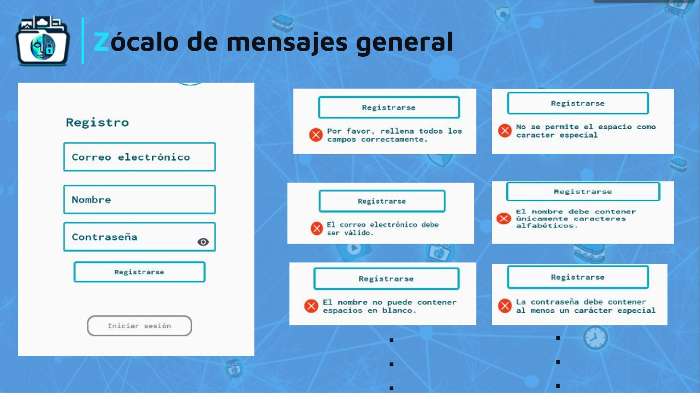
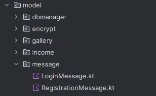

:toc:
:toc-title: Contenido
:icons: font
:source-highlighter: highlight.js
:experimental:
:leveloffset: 0.

= Zócalo de Mensaje

== Objetivo
** Los zócalos de mensajes son elementos importante en nuestra aplicación, estan diseñados para proporcionar orientación y mejorar la experiencia del usuario. A continuación, se explicara su objetivos y los diferentes iconos que encontrarás en nuestra aplicacion:

== Iconos de mensaje
** En nuestra aplicación, utilizamos tres tipos de iconos de mensaje para comunicar diferentes situaciones a los usuarios cuando realizan un acción.

image::../../../Recursos/iconos-msg-01.png[]
** Tiene como objetivo proporcionar una guía al usuario sobre cómo completar un campo específico. Es una forma de aclarar el propósito del campo y aconsejar al usuario.

** Este icono tiene como objetivo indicar precaución. Aparece cuando existen campos que no se están completando correctamente o cuando algo podría fallar. Es una señal para que el usuario revise la información antes de continuar.

image::../../../Recursos/iconos-msg-02.png[]
** Este icono tiene como objetivo indicar un error cuando el usuario completa un campo de manera erronea.

== Vista registration
** Registration: En la sección de registro, hay tres campos obligatorios que se deben completar: `correo electrónico`, `nombre de usuario` y `contraseña`. Para completar estos campos, se requieren ciertas condiciones.

=== Campo de Correo Electrónico 
** En el campo de Correo Electrónico, se le solicitará al usuario que proporcione una dirección de correo válida para completar su registro. Si el usuario ingresa un correo incorrecto, pueden aparecer los siguientes mensajes:

image::../../../Recursos/combinacionDeMensajes/diapositiva(Correo).JPG[700,700]
** Como se puede apreciar en la imagen, existen varios tipos de mensajes, los posibles mensajes son:

*** Mensaje Principal: Este mensaje estará activo hasta que el usuario ingrese un correo válido. Sirve como recordatorio para completar correctamente el campo.

*** Correo con Espacio: Si el usuario ingresa un correo con espacios, se mostrará un mensaje indicando que no se permite el uso de espacios. Además, el texto ingresado por el usuario se resaltará en rojo, lo que señala que algo está fallando.

*** Correo Registrado: Si un usuario ya se ha registrado con la dirección de correo proporcionada, se mostrará un mensaje informando que ese correo ya está en uso. En este caso, el usuario deberá ingresar una dirección diferente.

*** Correo Válido: Cuando el usuario completa correctamente el campo con una dirección de correo válida, todos los mensajes desaparecerán, indicando que se ha ingresado el correo correctamente.

=== Campo de Nombre

** En esta sección se le pedirá al usuario un nombre para su cuenta. Para generar un nombre de usuario existirán ciertas condiciones al completar este campo.

image::../../../Recursos/combinacionDeMensajes/diapositiva(nombre).JPG[]
** Análogamente a la imagen anterior, en el campo de nombre también existen posibles mensajes que se presentarán a la hora de completar este campo:

*** Mensaje Principal: Este mensaje estará activo cuando el usuario quiera ingresar sus datos, se le indicara cuál es el rango de letras permitido y que debe contener caracteres alfabéticos.

*** Nombre de Usuario Largo: Si el nombre de usuario supera los 50 caracteres, se mostrará un mensaje indicando que es demasiado largo. En este caso, el usuario deberá acortarlo, además, los datos ingresado se tornaran un tono rojo indicando que algo esta fallando.

*** Nombre con Espacio: Si el usuario ingresa un nombre que contiene espacios entre caracteres, se mostrará un mensaje indicando que no se admite espacio en el campo de nombre de usuario.

*** Nombre con número: Existe la posibilidad de que el usuario ingrese caracteres numéricos. En este caso, no se permitirá esta situación, generando un mensaje debajo del campo de nombre.

*** Nombre con caracteres especiales: Similar a la situación de los caracteres con espacio, no se permite poner caracteres especiales y se genera un mensaje indicando esta situación.

*** Nombre válido: En el caso de que el usuario ingrese un nombre respetando las condiciones anteriores, desaparecerán los iconos y mensajes de precaución o mensaje de error.

=== Campo de Contraseña

** En nuestra aplicación, el campo de Contraseña es crucial para la seguridad de las cuentas de los usuario, además es un dato fundamental para poder registrase. Al completar el campo, se pueden presentar diferentes tipos de mensajes:

image::../../../Recursos/combinacionDeMensajes/diapositiva(Contraseña).JPG[]
** A medida que el usuario ingresa la contraseña, puede surgir los mensajes de advertencia y error según los datos que se ingrese.

*** Mensaje principal: Al seleccionar el campo de contraseña, siempre existirá un mensaje predeterminado que solicita al usuario respetar ciertas condiciones para generar una contraseña. En este caso, las condiciones mínimas son 15 caracteres alfanuméricos y 1 carácter especial.

*** Contraseña con espacio: Si el usuario ingresa un espacio en el campo de contraseña, el texto ingresado se tornará en color rojo y se mostrará un mensaje de error indicando que no se permite el espacio en la contraseña.

*** Contraseña solo con caracteres especiales: Si el usuario ingresa solo caracteres especiales, se generará un mensaje indicando que la contraseña también debe contener caracteres alfanuméricos.

*** Contraseña solo con caracteres alfanuméricos: Existe la posibilidad de que el usuario ingrese solo caracteres alfanuméricos, pero no caracteres especiales. En este caso, se generará un mensaje indicando que debe ingresar un carácter especial para completar la contraseña.

*** Contraseña supera el rango de caracteres: Si el usuario ingresa una contraseña que supera el rango de 32 caracteres, se mostrará un mensaje de error indicando que ha superado el límite y el contenido del campo se tornará en rojo.

*** Contraseña válida: En el caso de que el usuario ingrese una contraseña respetando las condiciones pedidas, desaparecerá cualquier tipo de mensaje. 

=== Mensaje general:

*** En el caso hipotético de que el usuario no aprecio los mensajes de cada campo correspondiente y seleccione el botón `Registrarse`, aparecerá un mensaje de error indicando que existe un dato incorrecto en alguno de los campos. Esto impedirá que el usuario complete el registro y avance a la siguiente vista.

== Vista Login

** Login: En la vista de inicio de sesión, se pueden apreciar diferentes tipos de cuentas que los usuarios han ingresado. Además, se han implementado mensajes de sugerencia para guiar a los usuarios durante el proceso de inicio de sesión

=== Mensaje de busqueda

image::../../../Recursos/login/sugerenciademensaje.JPG[]

** En nuestra aplicación, hemos incluido un mensaje de sugerencia para facilitar la búsqueda de cuentas. Los usuarios pueden buscar su cuenta ingresando su nombre de usuario. Esto es especialmente útil cuando hay muchas cuentas registradas y puede resultar tedioso buscar manualmente.

image::../../../Recursos/login/MnesajeNoExisteElUsuario.JPG[]

** En caso de que el usuario ingrese un nombre que no esté registrado en nuestra aplicación, se mostrará un mensaje indicando que no se encuentra en nuestra base de datos

== Vista, controlador y modelo:

** Respetando el patrón de diseño MVC, se ha separado la vista, el controlador y el modelo de los zocalos de mensajes, a contunuacion se indicara las responasabilidades de cada paquete y se explicara cual es el objetivo de cada uno.

** view > Registration > InitialScreen.kt

image::../../../Recursos/MVC/view.JPG[]

*** El paquete `view` contiene toda la parte visual donde el usuario interactúa. En este caso, es el formulario de registro. El objetivo de la `view` es visualizar los campos de registro (nombre, correo, contraseña) y los botones (registrarse, iniciar seccion). A medida que el usuario rellena los campos, la vista envía los datos al controlador.

** Controller > messages > MessageController.kt

image::../../../Recursos/MVC/controller.JPG[]

*** El paquete `Controller` se encarga de gestionar los datos ingresados por el usuario y coordinar la comunicación entre la vista y el modelo. La funcion del controlador es recibir los datos enviados desde la vista (campos de registro completados por el usuario) y enviar esos datos al modelo para su análisis y procesamiento. por ultimo, Una vez que el modelo devuelve un resultado (por ejemplo, validación exitosa o error), el controlador actualiza la vista con la respuesta correspondiente.

** Model > message > RegistrationMessage.kt

*** El paquete `Model` contiene la lógica de negocio y la validación de datos. Las funciones del modelo es validar los datos, analiza los datos ingresados por el usuario (nombre, correo, contraseña) y verifica si cumplen con las condiciones requeridas. Contiene las reglas de negocio para la aplicación, por ejemplo, longitud mínima de contraseña, formato de correo válido, etc. por ultimo se obtiene una devolucion de resultados, el modelo envía una respuesta al controlador (éxitoso o erroneo) según el análisis de los datos.