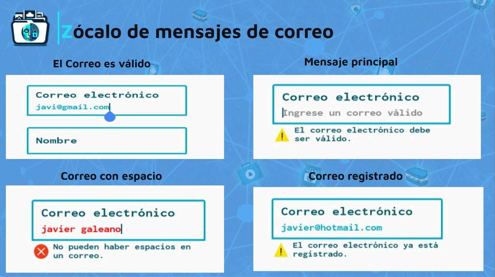

:toc:
:toc-title: Contenido
:icons: font
:source-highlighter: highlight.js
:experimental:
:leveloffset: 0.

= Zócalo de Mensaje

== Objetivo
** El objetivo de los zócalos de mensajes es guiar al usuario sobre qué debe completar en cada campo. Además, sirven para ofrecer consejos y mejorar la comodidad del usuario. También son útiles para proporcionar orientación.

== Iconos de mensaje
** En nuestra app existirán 3 tipos de imágenes para indicar situaciones posibles cuando el usuario realiza una acción:

image::../../../Recursos/iconos-msg-01.png[]
** Este icono tiene como objetivo clarificar para qué sirve un campo, es decir, dar una guía al usuario para realizar una acción.

image::../../../Recursos/iconos-msg-03.png[]
** El propósito de este icono es indicar que se debe tener precaución porque existen campos que no se están completando correctamente o algo puede fallar.

image::../../../Recursos/iconos-msg-02.png[]
** Este icono tiene como objetivo indicar un error cuando el usuario realiza una acción, generalmente al completar los campos durante el registro.

== Vista
** Registro: En la sección de registro, hay tres campos obligatorios que se deben completar: `correo electrónico`, `nombre de usuario` y `contraseña`. Para completar estos campos, se requieren ciertas condiciones.

=== Campo de Correo Electrónico 
** Se le pedirá al usuario un correo electrónico válido para registrarse. De lo contrario, pueden aparecer ciertos mensajes de precaución y error. Los posibles mensajes son:

** Como se puede apreciar en la imagen, existen varios tipos de mensajes.

*** Mensaje Principal: Debajo del campo de correo electrónico, se muestra un mensaje que estará activo hasta que el usuario ingrese un valor válido.

*** Correo con espacio: Si el usuario ingresa un correo con espacio, se indicará un mensaje de que no se permite el espacio y el texto ingresado por el usuario se tornará en rojo, haciendo entender que algo está fallando.

*** Correo registrado: Este mensaje indica que un usuario ya se ha registrado con ese correo, por lo que tendrá que ingresar otro correo.

*** Correo válido: Cuando se completa correctamente el campo, desaparecerán todos los mensajes, indicando que se completó el correo correctamente.

=== Campo de Nombre

** En esta sección se le pedirá al usuario un nombre para su cuenta. Para generar un nombre de usuario existirán ciertas condiciones al completar este campo.

image::../../../Recursos/combinacionDeMensajes/diapositiva(nombre).JPG[]
** Analogamente que la imagen anterior, en el campo de nombre tambien existen posibles mensajes:

*** Mensaje principal: Al posicionarse en el campo de nombre, existe un mensaje que indicará al usuario cuál es el rango de letras que puede ingresar y debe contener caracteres alfabéticos.

*** Nombre de usuario largo: Este mensaje se presentará cuando el nombre de usuario supera los 50 caracteres.

*** Nombre con espacio: Cuando el usuario ingrese un nombre que contenga espacio entre caracteres, se indicará un mensaje de que no se admite espacio en el campo de nombre.

*** Nombre con número: Existe la posibilidad de que el usuario ingrese caracteres numéricos. En este caso, no se permitirá esta situación, generando un mensaje debajo del campo de nombre.

*** Nombre con caracteres especiales: Similar a la situación de los caracteres con espacio, no se permite poner caracteres especiales y se genera un mensaje indicando esta situación.

*** Nombre válido: En el caso de que el usuario ingrese un nombre respetando las condiciones anteriores, desaparecerán los iconos y mensajes de precaución o mensaje de error.

=== Campo de Contraseña

** En este campo se le pedirá al usuario una contraseña como requisito para iniciar sesión. Al completar el campo, se pueden presentar diferentes tipos de mensajes:

image::../../../Recursos/combinacionDeMensajes/diapositiva(Contraseña).JPG[]
** A medida que el usuario ingresa la contraseña, puede surgir los mensajes de advertencia y error según los datos que se ingrese.

*** Mensaje principal: Al seleccionar el campo de contraseña, siempre existirá un mensaje predeterminado que solicita al usuario respetar ciertas condiciones para generar una contraseña. En este caso, las condiciones mínimas son 15 caracteres alfanuméricos y 1 carácter especial.

*** Contraseña con espacio: Si el usuario ingresa un espacio en el campo de contraseña, el texto ingresado se tornará en color rojo y se mostrará un mensaje de error indicando que no se permite el espacio en la contraseña.

*** Contraseña solo con caracteres especiales: Si el usuario ingresa solo caracteres especiales, se generará un mensaje indicando que la contraseña también debe contener caracteres alfanuméricos.

*** Contraseña solo con caracteres alfanuméricos: Existe la posibilidad de que el usuario ingrese solo caracteres alfanuméricos, pero no caracteres especiales. En este caso, se generará un mensaje indicando que debe ingresar un carácter especial para completar la contraseña.

*** Contraseña supera el rango de caracteres: Si el usuario ingresa una contraseña que supera el rango de 32 caracteres, se mostrará un mensaje de error indicando que ha superado el límite y el contenido del campo se tornará en rojo.

*** Contraseña válida: En el caso de que el usuario ingrese una contraseña respetando las condiciones pedidas, desaparecerá cualquier tipo de mensaje. 

== Controllador y logica:

** Respetando el patron de diseño, se separo la parte  de vista, controlador, logica (continura...)

