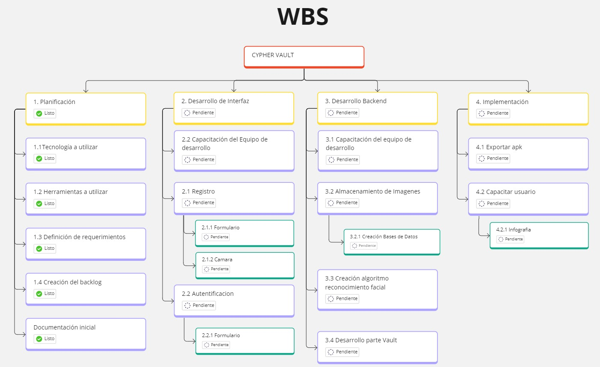

:toc:
:toc-title: INDICE
:icons: font
:source-highlighter: highlightjs
:experimental:
:leveloffset: 0.

= Proyecto de Reconocimiento Facial

*Primer cuatrimestre 2024 - Universidad Nacional de General Sarmiento - Comisión 02*

*Nombre del proyecto: InnovaSoft*

*Nombre del producto: Cypher Vault*

---

*Profesores:*

* Ing. Francisco Orozco De La Hoz @ forozco@campus.ungs.edu.ar 
* Lic. Leandro Dikenstein @ ldikenstein@campus.ungs.edu.ar 

*Equipo de trabajo:*

* Flavio Ybarra - flavio_712@hotmail.com - DNI: 36322712
* Alejandro Moras - spectrelonewolf@gmail.com - DNI: 31625246
* Javier Galeano - javi_b_galeano@hotmail.com - DNI: 41805228
* Melanie Ibarra - meluibarra15@gmail.com - DNI: 44301664
* Ivan Sanchez - ivansncz11@gmail.com - DNI: 42087962
* Fernando Trejo - fernandotrejo125@gmail.com - DNI: 43986607

---

== Introducción

Bienvenidos al proyecto Cypher Vault de Autenticación Facial en Kotlin. Este documento tiene como objetivo dar a conocer el desarrollo de una aplicación capaz de autenticar a los usuarios a través del reconocimiento facial enfocado para Tablets. La misma está diseñada para funcionar sin conexión a internet ofreciendo un servicio de almacenamiento de imágenes seguro y encriptado para el usuario.

== Objetivos del Proyecto

1. Desarrollar una aplicación de reconocimiento facial.
2. Implementar la aplicación en Android usando Kotlin y Android Studio.
3. Utilizar OpenCV y TensorFlow Lite para el reconocimiento facial.
4. Almacenar en el dispositivo imágenes cifradas/encriptadas.
5. Facilitar el uso de la aplicación para cualquier tipo de usuario.
6. Optimizar la aplicación para un uso eficiente de los recursos del dispositivo.

== Objetivos del Documento

Este documento tiene como objetivo explicar cuáles son los pasos a seguir  en el ciclo de vida del desarrollo de este software, es decir, se detallarán los requerimientos funcionales, no funcionales, armado de la WBS (funcionalidades del proyecto), definición de roles, estimaciones de implementación y diagrama de arquitectura. Más adelante se detalla mejor el objetivo de cada uno.

== Definición de Roles

- **Líder del Proyecto**: Es el individuo responsable de administrar el proyecto.
- **Scrum Master**: Supervisa el progreso del proyecto y se asegura de que se cumplan los plazos.
- **Desarrolladores**: Encargados de la codificación y la implementación de la aplicación.
- **Tester**: Responsable de probar la aplicación en diferentes escenarios y reportar errores.

== Equipo de Trabajo y Roles

[cols=3*]
|===
| Nombre | Rol Primario | Rol Secundario
| Profesor | Líder del Proyecto | Sponsor
| Flavio Ybarra | Scrum Master | Tester
| Alejandro Moras | Desarrollador | UX/UI
| Fernando Trejo | Desarrollador | UX/UI
| Javier Galeano | Desarrollador | UX/UI
| Ivan Sanchez | Tester | Capacitador y Prueba de Usuario
| Melanie Ibarra | Tester | Scrum Master
|===

== Metodología

En este proyecto, implementaremos una combinación de metodologías ágiles y Waterfall, también conocida como "Wagile" o "Agilefall". Este enfoque nos permitirá aprovechar lo mejor de ambos métodos para adaptarnos a las necesidades específicas de nuestro equipo de seis personas. A continuación les presentaremos un resumen de cómo lo haremos:

* *Comprender las metodologías:* Todo el equipo debe entender Agile y Waterfall.
* *Identificar las fases del proyecto:* Dividiremos el proyecto en fases claramente definidas.
* *Aplicar Waterfall en las fases iniciales:* Usaremos Waterfall para la planificación, análisis de requerimientos y diseño.
* *Implementar Agile en las fases de desarrollo:* Aplicaremos Agile para las fases de desarrollo y pruebas.
* *Facilitar la comunicación y colaboración:* Fomentaremos la comunicación abierta y la colaboración durante todo el proceso.
* *Realizar retrospectivas periódicas:* Programaremos reuniones regulares de retrospectiva al final de cada fase o sprint.
* *Ser flexible y adaptativo:* Mantendremos una mentalidad flexible y adaptativa a medida que evolucione el proyecto.

Nuestro enfoque Agile se enfocará en Scrum, el cuál se basa en entregar funcionalidades de forma incremental, en períodos de dos semanas. Dentro de las mismas se realizan reuniones diarias del equipo para planificación, control y revisión del trabajo realizado hasta el momento.

Con este enfoque, nuestro equipo podrá gestionar eficazmente el proyecto, adaptarse a los cambios y entregar valor de manera constante y oportuna.

== Enlaces

* *Repositorio:* se decidió utilizar Github para que todos los miembros del equipo puedan acceder y trabajar con mayor comodidad. 
<a href="https://github.com/ferrt1/TP_Labo_Principal" target="_blank">Repositorio Github</a>

* *WBS:* Se decidio utilizar Miro que es una plataforma de colaboración digital para realizar la WBS. Por motivos de seguridad no se compartirá el link pero la misma se mostrará en la documentación.

** *Herramientas a utilizar:* Android Studio, OpenCV, TensorFlow Lite, Visual Studio.

** *Comunicación de equipo:* WhatsApp y Discord.

** *User Stories:* Trello

** *Comunicación con el Líder del Proyecto:* Telegram o Mail.

** *Diagrama de arquitectura:* draw.io

== Gestión

=== Misión y Visión del Negocio

*Nuestra visión:* Aspirar en que sea una aplicación cómoda y fácil de usar dentro de los estandares de seguridad para así brindar tranquilidad y seguridad al usuario.

*Nuestra misión:* Es crear una aplicación de almacenamiento de imágenes privadas las cuáles son encriptadas en el dispositivo, donde el usuario se registra e ingresa a través del reconocimiento facial mediante la utilizacion de la cámara frontal del dispositivo (tablet). 

Posteriormente el ingreso del usuario se realizará comparando la foto tomada con las imágenes guardadas en el dispositivo, estas imágenes estan encriptadas y cifradas.

* *Alcance:*

** Aplicación para dispositivos Android (Tablets).
** Registro por reconocimiento facial.
** Login por reconocimiento fácil.
** Almacenamiento de imágenes en el dispositivo.

* *Fuera del alcance:*

** Aplicaciones para IOS y Computadoras.
** Varios idiomas.
** Registro biometrico en oscuridad.
** No contemplamos diseño de la aplicacion con interfaz en vertical.

NOTE: *Poca información:* sobre la implementación de la app no podemos confirmar las funcionalidades que quedan por fuera del alcance.

=== Plan de Comunicaciones

Para facilitar la comunicación utilizamos la plataforma WhatApps y Discord, ya que nos proporcionan un canal de comunicación instantánea y versátil, que permite una interacción ágil entre los miembros del equipo. Esto nos permite compartir actualizaciones rápidas, discutir ideas y mantenernos conectados en tiempo real.
Para gestionar las tareas y el progreso del proyecto, se utilizará Trello. Nos permitió crear un flujo de trabajo estructurado y asignar tareas, asegurando que cada miembro del equipo esté al tanto de sus responsabilidades y plazos.

=== Requerimientos

En este apartado se detallarán los requerimientos del sistema, además se hará mención de la nomenclatura a utilizar para la clasificación de dichos requerimientos.
Los requerimientos funcionales son aquellos que definen la funcionalidades que va a tener el software. Tales requerimientos se clasifican en estos tres tipos:

*Requerimientos esenciales:* Estos requerimientos hacen que el sistema tenga sentido, es decir, sin esta clases de funcionamientos no se cumplirían el objetivo que necesitan los usuarios.

*Requerimientos importantes:* Son aquellos que, si no están, el software funciona igual pero se limitará el funcionamiento.

*Requerimientos deseables:* Son componentes adicionales que pueden ser agregados al software pero su prioridad es la mínima.

Una vez explicado las clasificación de requerimientos funcionales,  se hará a continuación mención de los requerimientos no funcionales:

*Requerimientos No funcionales:* El objetivo de estos requerimientos es explicar las limitaciones o restricciones que el sistema posee. Estos requisitos no tienen ningún impacto en la funcionalidad del software, pero garantizan que el sistema satisfaga las necesidades de los usuarios del sistema.

* Funcionales:
** Registro:
*** El sistema debe ser capaz de capturar imágenes de la cámara frontal de la Tablet.
*** Se debe crear una interfaz de login donde el usuario se registre con sus datos (nombre y mail) y su rostro.
*** La interfaz debe tener un boton para capturar la imagen.
*** Tiene que solicitar los permisos necesarios para acceder a la camara
*** Se debera guardar la imagen en una base de datos almacenada en la tablet
*** El sistema debe ser capaz de detectar rostros en las imágenes capturadas.
*** El sistema debe ser capaz de identificar a las personas a partir de sus rostros.
*** Asociar las rostros de las personas a su cuenta de registro
    
** Autentificación
    
*** Una vez registrado el usuario debe ser capaz de loguearse a su cuenta atraves de la verificaion facial
*** El sistema debe ser capaz de autenticar a las personas comparando sus rostros con una base de datos de rostros conocidos almacenada en la Tablet.
*** El sistema debe mostrar un mensaje de "Acceso Permitido" o "Acceso Denegado" en la pantalla de la Tablet en función del resultado de la autenticación.
*** El sistema deberá registrar un log con los datos de ingresos (Hora, ID de persona, etc.)
*** El sistema deberá permitir una alternativa manual de ingreso ante posibles desconexiones (sin Wifi o datos).
    
** Perfil de usuario

*** El sistema deberá permitir el ALTA/MODIFICACIONES de las personas a autenticar.
*** El usuario podra modificar su informacion personal o registrar otra foto de su rostro.
    
* No Funcionales:
** Usabilidad:
*** Si el usuario desea entrar y no esta registrado se le debe mostrar un mensaje de "acceso denegado, primero necesitas registrarte"
*** Si el usuario desea ingresar a su cuenta con una foto u otro rostro (no asociado a su cuenta) se le debe mostrar un mensaje de "acceso denegado".
*** Si el usuario pudo ingresar a su cuenta se le debe mostrar un mensaje de "acceso permitido".
    
** Rendimiento   
*** El sistema debe ser eficiente en el uso de la batería, la memoria y el procesador de la Tablet.
    
=== WBS

=== Diccionario

Los pesos se clasifican en base a:
- 3: Esencial
- 2: Importante
- 1: Deseable

[cols=6*,options=header]
|===
| ID | NOMBRE | DESCRIPCIÓN | TAREA  | RESPONSABLE | PESO
| 1 | Planificación | Planificación sobre las tareas que la componen | Planificación, investigación | Todo el equipo | 3 
| 1.1 | Tecnologías a utilizar | Investigar sobre las tecnologías a utilizar | Investigación | Todo el equipo | 3 
| 1.2 | Herramientas a utilizar | Investigar sobre las herramientas a utilizar | Investigación | Todo el equipo | 3 
| 1.3 | Definición de requerimientos | Definir los requerimientos del proyecto | Documentación | Todo el equipo | 3 
| 1.4 | Creación del backlog | Crear backlog | Planificación  | Scrum Master | 3 
| 1.5 | Documentación inicial | Crear la documentación | Planificación | Todo el equipo | 3 
| 2 | Desarrollo de Interfaz | Desarrollar la interfaz | Desarrollo | Equipo de desarrollo | 2 
| 2.1 | Capacitación del Equipo de Desarrollo | Capacitar al equipo con las tecnologías a utilizar | Capacitación | Equipo de desarrollo | 2 
| 2.2 | Registro | Crear interfaz registro | Desarrollo | Equipo de desarrollo | 2 
| 2.2.1 | Formulario | Creación del formulario | Desarrollo | Equipo de desarrollo | 2 
| 2.2.2 | Cámara | Implementar cámara en interfaz | Desarrollo | Equipo de desarrollo | 2 
| 2.3 | Autentificación | Implementar interfaz de autentificación | Desarrollo | Equipo de desarrollo | 2 
| 2.3.1 | Formulario | Creación de formulario de autentificación | Desarrollo | Equipo de desarrollo | 2 
| 3 | Desarrollo backend | Desarrollar la lógica de la aplicación | Desarrollo | Equipo de desarrollo | 3 
| 3.1 | Capacitación del equipo de desarrollo | Capacitar al equipo de desarrollo con las tecnologías a utilizar | Capacitación | Equipo de desarrollo | 2 
| 3.2 | Almacenamiento de imágenes | Almacenar las imágenes en el dispositivo del usuario | Desarrollo | Equipo de desarrollo | 2 
| 3.2.1 | Creación de Base de Datos | Crear base de datos | Desarrollo | Equipo de desarrollo | 2 
| 3.3 | Crear algoritmo reconocimiento facial | Implementación de lógica de reconocimiento facial | Desarrollo | Equipo de desarrollo | 3 
| 3.4 | Desarrollo parte Vault | Implementar aplicación de galería privada | Desarrollo | Equipo de desarrollo | 3 
| 4 | Implementación | Puesta en servicio de la aplicación | Implementación | Capacitador y Prueba de Usuario, Equipo de desarrollo | 2 
| 4.1 | Exportar apk | Compilación del proyecto a formato de dispositivo android | Implementación | Equipo de desarrollo | 2 
| 4.2 | Capacitar usuario | Capacitar a usuario final | Capacitación | Capacitador y Prueba de Usuario | 2 
| 4.2.1 | Infografía | Mostrar imagen de uso | Capacitación | Capacitador y Prueba de Usuario | 2 
|===

=== Calendario

[cols=6*,options=header]
|===
| Entrega | Fecha | Tareas 
| 1 | (19/4)| Sprint 0 
| 2 | (3/4) | Reunión Formal 1 
| 3 | (17/5) | Reunión Formal 2 
| 4 | (31/5) | Reunión Formal 3 
| 5 | (14/6) | Reunión Formal 4 
| 6 | (28/6) | Reunión Formal 5 
|===

=== Estimaciones Iniciales

Se entregará un prototipo de la interfaz funcional para el registro, la autentificación y base de datos. Estimamos que el tiempo empleado será:

* *Capacitación del equipo en las tecnologías:* 5hs por cada desarrollador y tester.
* *Desarrollo:* 20hs por cada desarrollador.
* *Testing:* 10hs por tester.

=== Riesgos

* Baja de un integrante del equipo.
* Superposición de tareas fuera de la materia.
* Enfermedad de un integrante.
* Dificultad en la comprensión de nuevas tecnologías.
* Impedimento con las herramientas de trabajo.
* Planificación inadecuada por falta de experiencia.
* Conflicto en el equipo en cuanto a comunicación.
* Cambios excesivos de los requerimientos.
* Retrasos en el desarrollo.
  
=== Entregables

Definimos los hitos que ocurrirán en las diferentes fechas del proyecto. El primer hito se enfocará en la presentación formal del proyecto al cliente. En esta se explicará el plan de gestión que tendremos para administrar el proyecto.
En los hitos restantes se presentará al cliente los avances en el producto.

* Presentación del proyecto el día 19/09
* Reunión formal 1 el día 19/04
* Reunión formal 2 el día 03/05
* Reunión formal 3 el día 17/05
* Reunión formal 4 el día 31/05
* Reunión formal 5 el día 14/06
* Presentación final el día 28/06

=== Administración en el Manejo de Bugs

Ejecutar una gestión eficaz de errores y pruebas es un componente esencial en un sistema de software. Estas tareas son vitales para asegurar que el sistema opere de forma fiable, eficiente y satisfaga las necesidades de los usuarios.

WARNING: *Haremos un seguimiento de los errores en Trello:* proporcionando en la tarjeta una explicación del fallo, el entorno en el que se produce, y datos útiles para su posible corrección. Los categorizaremos en tres niveles de acuerdo a su severidad: bajo, medio o alto. Esto nos permitirá determinar cuáles son las dificultades más urgentes y cuáles son de menor prioridad.

=== Administración de Cambios

La administración eficiente de cambios es crucial para el triunfo de cualquier proyecto. Los cambios pueden aparecer por varias causas, como nuevas demandas del cliente, hallazgos durante el desarrollo, o variaciones en las condiciones del mercado. En este informe, se explica cómo planeamos registrar, validar y supervisar las modificaciones en nuestro proyecto, así como quién es el encargado de cada una de estas tareas.

Para registrar los cambios, emplearemos diversas herramientas y procedimientos: 
* *Trello:* como se mencionó previamente, será nuestra plataforma principal para el seguimiento y administración de modificaciones.
* *Recolección de peticiones de cambios:* se anexarán todas las peticiones de cambios que incluirán detalles exhaustivos sobre cada petición de modificación. Esto abarcará una descripción de la modificación, su razón, el impacto anticipado en el proyecto y cualquier documentación de apoyo pertinente.
* *Informe de Progreso:* se mantendrá un informe de progreso actualizado que contendrá un registro de todas los cambios aprobados y pendientes. Esto ofrecerá una visión general del estado actual del proyecto en relación con las modificaciones.

=== Indicadores a Utilizar

* Funcionalidad Completa
* Nivel de Calidad
* Evolución de la Prueba
* Burndown Chart

=== Tecnologías

* *Android Studio:* Es un entorno de desarrollo integrado gratuito diseñado específicamente para el desarrollo de aplicaciones Android. 
* *Kotlin:* Kotlin Es un lenguaje de programación de código abierto para aplicaciones Android.
* *OpenCV:* Es una biblioteca que proporciona una amplia gama de funciones y algoritmos para el procesamiento de imágenes y vídeo
* *TensorFlow Lite* TensorFlow Lite es un marco de trabajo ligero desarrollado por Google que permite ejecutar modelos de aprendizaje automático en dispositivos móviles e integrados.
* *SQLite:* SQLite es un sistema de gestión de bases de datos relacional (RDBMS) ligero, rápido, autónomo y de código abierto.

==== Visual Studio Code

image::imagenAdoc/logovisualstudio.png[100,100]

Fuente: link:https://visualstudio.microsoft.com/es/[Microsoft.com/VisualStudio]

*Dentro del proyecto su uso no es primario, pero si se utiliza para revisar las clases dentro del proyecto de Android Studio, por otro lado es una gran herramienta a la hora de confeccionar el informe / documentacion del proyecto.*

Editor de código fuente independiente que se ejecuta en Windows, macOS y Linux. El IDE de Visual Studio es una plataforma de lanzamiento creativa que puede utilizar para editar, depurar y compilar código y, finalmente, publicar una aplicación. Además del editor y depurador estándar que ofrecen la mayoría de IDE, Visual Studio incluye compiladores, herramientas de completado de código, diseñadores gráficos y muchas más funciones para mejorar el proceso de desarrollo de software.

==== Android Studio

image::imagenAdoc/logoandroidstudio.png[200,200]

Fuente: link:https://developer.android.com/studio?hl=es-419[Android.com/Developer]

*Es la herramienta principal del desarrollo de la aplicacion, el mismo es un IDE robusto el cual cuenta con varias funcionalidades las cuales acompañan las etapas de desarrollo, depuracion, testeo e implementacion.*

Entorno de desarrollo integrado (IDE) oficial del desarrollo de apps para Android. Basado en el potente editor de código y las herramientas para desarrolladores de IntelliJ IDEA, Android Studio ofrece aún más funciones que mejoran tu productividad cuando compilas apps para Android, como las siguientes:

* Un sistema de compilación flexible basado en Gradle
* Un emulador rápido y cargado de funciones
* Un entorno unificado donde puedes desarrollar para todos los dispositivos Android
* Ediciones en vivo para actualizar elementos componibles en emuladores y dispositivos físicos, en tiempo real
* Integración con GitHub y plantillas de código para ayudarte a compilar funciones de apps comunes y también importar código de muestra
Variedad de marcos de trabajo y herramientas de prueba
* Herramientas de Lint para identificar problemas de rendimiento, usabilidad y compatibilidad de versiones, entre otros
* Compatibilidad con C++ y NDK
* Compatibilidad integrada con Google Cloud Platform, que facilita la integración con Google Cloud Messaging y App Engine.

NOTE: *Aclaracion:* Dentro del equipo de desarrollo y testeo utilizamos los mismos dispositivos celulares para emular y testear la implementacion/desarrollo, ya que en algunos casos es imposible por las capacidades computacionales de los equipos ( computadoras ) de cada uno de los integrantes.

===== Implementacion

*En esta seccion se pasa a detallar cada una de las partes del desarrollo, junto a sus herramientas, ya que dentro de android studio como se detallo anteriormente se encuentran funcionalidades especificas.*

Para comenzar nos encontramos con el ultimo IDE estable lanzado por Android, el cual es la version Iguana, luego se creo un proyecto con la version minima compatible recomendada por el mismo. Teniendo esto en cuenta nuestra aplicacion es compatible desde Android 7 hasta la ultima version lanzada al dia de hoy.

NOTE: *¿Por que no versiones anteriores?:* Porque esto genera problemas en las dependencias ( funcionalidades ofrecidas por android ) disponibles, lo cual provoca que la aplicacion pierda posibilidades de escalado, ya que hay versiones anteriores que resultan incompatibles con las mismas dependencias.

====== INTERFAZ

Fuente: link:https://developer.android.com/develop/ui/compose[android.com/compose]

Fuente: link:https://developer.android.com/reference/androidx/navigation/NavController[android.com/nav_controller]

Fuente: link:https://developer.android.com/reference/kotlin/androidx/compose/runtime/Composable[android.com/composable]

Fuente: link:https://developer.android.com/reference/android/util/Patterns[android.com/patterns]

El código se divide en tres paquetes que se encuentran en `app > src > main > java > com.example.cypher_vault`. Acá hay dos paquetes: uno llamado 'controller' y otro llamado 'view'.

*Paquete Controller > Authentication*

** AuthenticationController.kt
*** `AuthenticationController` es una clase que toma como parámetro un `NavController` y devuelve el `NavController` con la dirección a la que debe navegar. 
Cada dirección tiene su propia función: `fun navigateToCamera()`, `fun navigateToConfirmation()`, `fun navigateToLogin()` (esta última falta implementar).

[source,kotlin]
----
fun registerUser( # <1>
        email: String,
        name: String,
        showDialog: MutableState<Boolean>,
        errorMessage: MutableState<String>
    )
----
<1> La función `registerUser` valida los campos por el momento. Más adelante deberá enviarlos al modelo para guardarlos en la base de datos. 
Recibe como parámetros `email`, `name`, `showDialog` y `errorMessage`. Estos parámetros son para que salga la alerta y mostrarla con sus respectivos mensajes.
Si todos los campos están bien, llama a `navigateToCamera` y los manda a la cámara.

* Las funciones `validateMail()`, `validateName()` y `validateFields` verifican la validez de los campos de entrada.
** `validateMail(email: String)`: Se fija que se cumpla android.util.Patterns.EMAIL_ADDRESS.matcher(email).
** `validateName(name: String)`: Se fija que no tenga menos de 3 carácteres el nombre.
** `validateFields(name: String, email: String)`: Se fija que no esten vacios.

*Paquete View > Registration*

.NavigationHost.kt
[source,kotlin]
----
fun NavigationHost() # <1>
----
<1> `NavigationHost()` es una función que se utiliza para manejar la navegación en la aplicación, cada vez que se presiona un botón cambia las pantallas. 

NOTE: *Aclaracion:* Empieza en register por predeterminado y luego va cambiando, toma como parámetro las direcciones que le pasa el AuthenticationController, .

* **Definición de pantallas**: Dentro de esta función `NavHost`, se definen varias pantallas que representan diferentes partes:
** *register*: Esta es la pantalla inicial donde los usuarios pueden registrarse. Muestra `InitialScreen`.
** *camera* Esta es la pantalla donde los usuarios pueden usar la cámara durante el proceso de registro. Muestra `RegistrationCameraScreen`.
** *confirmation*: Esta es la pantalla donde los usuarios pueden confirmar su registro. Muestra `ConfirmationScreen`.
** *login*: Esta es la pantalla donde los usuarios pueden iniciar sesión. Falta implementar.

.InitialScreen.kt
[source,kotlin]
----
fun RegistrationCameraScreen(authenticationController: AuthenticationController) # <1>
----
<1> Recibe como parametro authenticationController para luego poder navegar por la aplicacion

`InitialScreen` es la pantalla inicial donde los usuarios se van a registrar. Se encuentran los campos de entrada para el correo electrónico y el nombre. Al hacer clic en el botón "Registrarse", se llama al método `registerUser` del 
`AuthenticationController`.

.RegistrationCameraScreen.kt
[source,kotlin]
----
fun RegistrationCameraScreen(authenticationController: AuthenticationController) # <1>
----
<1> Recibe como parametro authenticationController para luego poder navegar por la aplicacion

Esta función Muestra la vista previa de la cámara
`ProcessCameraProvider:` Esta es una clase que se utiliza para interactuar con las cámaras disponibles en el dispositivo. En este caso, se obtiene una instancia de ProcessCameraProvider y 
se recuerda para su uso posterior.

`CameraSelector:` Esta es una clase que se utiliza para seleccionar una cámara en el dispositivo. En este caso, se está seleccionando la cámara frontal.

[source,kotlin]
----
fun CloseCameraButton(isCameraOpen: MutableState<Boolean>,
                      cameraProvider: ProcessCameraProvider,
                        authenticationController: AuthenticationController) # <1>
----
<1> Botón que se muestra para cerrar la cámara e ir a la parte de ConfirmationScreen

[source,kotlin]
----
fun CameraPreview(preview: Preview) # <1>
----
<1> Muestra la vista previa de la cámara en la interfaz de usuario. Utiliza la clase AndroidView para mostrar la vista previa de la cámara en la interfaz de usuario de Compose.

.ConfirmationScreen.kt
[source,kotlin]
----
fun ConfirmationScreen(authenticationController: AuthenticationController) # <1>
----
<1> Recibe como parametro authenticationController para luego poder navegar por la aplicacion

`ConfirmationScreen` Es una pantalla que muestra un mensaje de que se pudo registrar y un botón para iniciar sesión

*Paquete View > Login*

.LoginList.kt
[source,kotlin]
----
fun NavigationLogin(authenticationController: AuthenticationController) # <1>
----
<1> `NavigationLogin()`: Esta función se encarga de mostrar un lista de los usuarios que ya están registrados en la aplicación. Permite a los usuarios navegar a través de sus cuentas de forma eficiente.  

[source,kotlin]
----
fun loginCamera(authenticationController: AuthenticationController, user: String) # <1>
----
<1> La función `loginCamera` se activa después de que el usuario ha seleccionado su cuenta. Su propósito es encender la cámara frontal para realizar una verificación biométrica,asegurándose de que la cuenta seleccionada pertenezca realmente al usuario en cuestión. Esta validación permite mantener la seguridad y la integridad de la cuenta.

[source,kotlin]
----
fun CloseCameraButton(cameraProvider: ProcessCameraProvider, authenticationController: AuthenticationController) # <1>
----
<1> La función `CloseCameraButton` permite al usuario cerrar la cámara frontal si se ha seleccionado una cuenta incorrecta. Ofrece una interfaz para regresar de manera rápida al inicio de sesión, específicamente a la pantalla de `NavigationLogin`, facilitando el desplazamiento dentro de la aplicación.

