:toc:
:toc-title: INDICE
:icons: font
:source-highlighter: highlightjs
:experimental:
:leveloffset: 0.

= Proyecto de Reconocimiento Facial

image::imagenAdoc/logofacultad.png[700,700]

*Primer cuatrimestre 2024 - Universidad Nacional de General Sarmiento - Comisión 02*

*Nombre del proyecto: InnovaSoft*

*Nombre del producto: Cypher Vault*

---

*Profesores:*

* Ing. Francisco Orozco De La Hoz @ forozco@campus.ungs.edu.ar 
* Lic. Leandro Dikenstein @ ldikenstein@campus.ungs.edu.ar 

*Equipo de trabajo:*

* Flavio Ybarra - flavio_712@hotmail.com - DNI: 36322712
* Alejandro Moras - spectrelonewolf@gmail.com - DNI: 31625246
* Javier Galeano - javi_b_galeano@hotmail.com - DNI: 41805228
* Melanie Ibarra - meluibarra15@gmail.com - DNI: 44301664
* Ivan Sanchez - ivansncz11@gmail.com - DNI: 42087962
* Fernando Trejo - fernandotrejo125@gmail.com - DNI: 43986607

---

== Introducción

Bienvenidos al proyecto Cypher Vault de Autenticación Facial en Kotlin. Este documento tiene como objetivo dar a conocer el desarrollo de una aplicación capaz de autenticar a los usuarios a través del reconocimiento facial enfocado para Tablets. La misma está diseñada para funcionar sin conexión a internet ofreciendo un servicio de almacenamiento de imágenes seguro y encriptado para el usuario.

== Objetivos del Proyecto

1. Desarrollar una aplicación de reconocimiento facial.
2. Implementar la aplicación en Android usando Kotlin y Android Studio.
3. Utilizar OpenCV y TensorFlow Lite para el reconocimiento facial.
4. Almacenar en el dispositivo imágenes cifradas/encriptadas.
5. Facilitar el uso de la aplicación para cualquier tipo de usuario.
6. Optimizar la aplicación para un uso eficiente de los recursos del dispositivo.

== Objetivos del Documento

Este documento tiene como objetivo explicar cuáles son los pasos a seguir  en el ciclo de vida del desarrollo de este software, es decir, se detallarán los requerimientos funcionales, no funcionales, armado de la WBS (funcionalidades del proyecto), definición de roles, estimaciones de implementación y diagrama de arquitectura. Más adelante se detalla mejor el objetivo de cada uno.

== Definición de Roles

- **Product Owner**: Es el individuo que representa al cliente en el proyecto.
- **Scrum Master**: Supervisa el progreso del proyecto y se asegura de que se cumplan los plazos.
- **Development team**: Encargados de la codificación, el testeo y la implementación de la aplicación.

== Equipo de Trabajo y Roles

[cols=3*]
|===
| Nombre | Rol Primario | Rol Secundario
| Francisco Orozco De La Hoz | Product Owner | -
| Flavio Ybarra | Scrum Master | Tester
| Alejandro Moras | Desarrollador | UX/UI
| Fernando Trejo | Desarrollador | UX/UI
| Javier Galeano | Desarrollador | UX/UI
| Ivan Sanchez | Tester | Capacitador y Prueba de Usuario
| Melanie Ibarra | Tester | Scrum Master
|===

== Metodología

En este proyecto, implementaremos una combinación de metodologías ágiles y Waterfall, también conocida como "Wagile" o "Agilefall". Este enfoque nos permitirá aprovechar lo mejor de ambos métodos para adaptarnos a las necesidades específicas de nuestro equipo de seis personas. A continuación les presentaremos un resumen de cómo lo haremos:

* *Comprender las metodologías:* Todo el equipo debe entender Agile y Waterfall.
* *Identificar las fases del proyecto:* Dividiremos el proyecto en fases claramente definidas.
* *Aplicar Waterfall en las fases iniciales:* Usaremos Waterfall para la planificación, análisis de requerimientos y diseño.
* *Implementar Agile en las fases de desarrollo:* Aplicaremos Agile para las fases de desarrollo y pruebas.
* *Facilitar la comunicación y colaboración:* Fomentaremos la comunicación abierta y la colaboración durante todo el proceso.
* *Realizar retrospectivas periódicas:* Programaremos reuniones regulares de retrospectiva al final de cada fase o sprint.
* *Ser flexible y adaptativo:* Mantendremos una mentalidad flexible y adaptativa a medida que evolucione el proyecto.

Nuestro enfoque Agile se enfocará en Scrum, el cuál se basa en entregar funcionalidades de forma incremental, en períodos de dos semanas. Dentro de las mismas se realizan reuniones diarias del equipo para planificación, control y revisión del trabajo realizado hasta el momento.

Con este enfoque, nuestro equipo podrá gestionar eficazmente el proyecto, adaptarse a los cambios y entregar valor de manera constante y oportuna.

== Enlaces

* *Repositorio:* se decidió utilizar Github para que todos los miembros del equipo puedan acceder y trabajar con mayor comodidad. 
link:https://github.com/ferrt1/TP_Labo_Principal[Repositorio Github]

* *WBS:* Se decidio utilizar Miro que es una plataforma de colaboración digital para realizar la WBS. Por motivos de seguridad no se compartirá el link pero la misma se mostrará en la documentación.

** *Herramientas a utilizar:* Android Studio, OpenCV, TensorFlow Lite, Visual Studio.

** *Comunicación de equipo:* WhatsApp y Discord.

** *User Stories:* Trello

** *Comunicación con el Product Owner:* Telegram o Mail.

** *Diagrama de arquitectura:* draw.io

== Gestión

=== Misión y Visión del Negocio

*Nuestra visión:* Aspirar en que sea una aplicación cómoda y fácil de usar dentro de los estandares de seguridad para así brindar tranquilidad y seguridad al usuario.

*Nuestra misión:* Es crear una aplicación de almacenamiento de imágenes privadas las cuáles son encriptadas en el dispositivo, donde el usuario se registra e ingresa a través del reconocimiento facial mediante la utilizacion de la cámara frontal del dispositivo (tablet). 

Posteriormente el ingreso del usuario se realizará comparando la foto tomada con las imágenes guardadas en el dispositivo, estas imágenes estan encriptadas y cifradas.

* *Alcance:*

** Aplicación para dispositivos Android (Tablets).
** Registro por reconocimiento facial.
** Login por reconocimiento fácil.
** Almacenamiento de imágenes en el dispositivo. (imagenes formato tipo: jpg, png, jpeg, gif, bmp y webp)
** Registro Alternativo (Password, Codigo enviado a traves del mail y pregunta por última conexión)
** Compartir imágenes.

* *Fuera del alcance:*

** Aplicaciones para IOS y Computadoras.
** Varios idiomas.
** Registro biometrico en oscuridad.
** No contemplamos diseño de la aplicacion con interfaz en vertical.
** Multiples formatos de archivos (videos, audios, etc)

NOTE: *Poca información:* sobre la implementación de la app no podemos confirmar las funcionalidades que quedan por fuera del alcance.

=== Plan de Comunicaciones

Para facilitar la comunicación, empleamos la plataforma WhatsApp, que nos brinda un canal de comunicación instantánea y versátil. Esto nos permite interactuar ágilmente entre los miembros del equipo, compartir actualizaciones rápidas y discutir ideas en tiempo real. Además, utilizamos Discord para llevar a cabo reuniones diarias y charlas técnicas.
En cuanto a la gestión de tareas y el seguimiento del proyecto, recurrimos a Trello. Esta herramienta nos permitió crear un flujo de trabajo estructurado y asignar tareas, asegurando que cada miembro del equipo estuviera al tanto de sus responsabilidades y plazos.
Adicionalmente, mantenemos reuniones presenciales con nuestro product owner para garantizar que nuestro producto final cumpliera con los requisitos del cliente. Además de la posibilidad de mantener contacto a través de Telegram

=== Requerimientos

En este apartado se detallarán los requerimientos del sistema, además se hará mención de la nomenclatura a utilizar para la clasificación de dichos requerimientos.
Los requerimientos funcionales son aquellos que definen la funcionalidades que va a tener el software. Tales requerimientos se clasifican en estos tres tipos:

*Requerimientos esenciales:* Estos requerimientos hacen que el sistema tenga sentido, es decir, sin esta clases de funcionamientos no se cumplirían el objetivo que necesitan los usuarios.

*Requerimientos importantes:* Son aquellos que, si no están, el software funciona igual pero se limitará el funcionamiento.

*Requerimientos deseables:* Son componentes adicionales que pueden ser agregados al software pero su prioridad es la mínima.

Una vez explicado las clasificación de requerimientos funcionales,  se hará a continuación mención de los requerimientos no funcionales:

*Requerimientos No funcionales:* El objetivo de estos requerimientos es explicar las limitaciones o restricciones que el sistema posee. Estos requisitos no tienen ningún impacto en la funcionalidad del software, pero garantizan que el sistema satisfaga las necesidades de los usuarios del sistema.

* Funcionales:
** Registro:
*** El sistema debe ser capaz de capturar imágenes de la cámara frontal de la Tablet.
*** Se debe crear una interfaz de login donde el usuario se registre con sus datos (nombre y mail) y su rostro.
*** La interfaz debe tener un boton para capturar la imagen.
*** Tiene que solicitar los permisos necesarios para acceder a la camara
*** Se debera guardar la imagen en una base de datos almacenada en la tablet
*** El sistema debe ser capaz de detectar rostros en las imágenes capturadas.
*** El sistema debe ser capaz de identificar a las personas a partir de sus rostros.
*** Asociar las rostros de las personas a su cuenta de registro
    
** Autentificación
    
*** Una vez registrado el usuario debe ser capaz de loguearse a su cuenta atraves de la verificaion facial
*** El sistema debe ser capaz de autenticar a las personas comparando sus rostros con una base de datos de rostros conocidos almacenada en la Tablet.
*** El sistema debe mostrar un mensaje de "Acceso Permitido" o "Acceso Denegado" en la pantalla de la Tablet en función del resultado de la autenticación.
*** El sistema deberá registrar un log con los datos de ingresos (Hora, ID de persona, etc.)
*** El sistema deberá permitir una alternativa manual de ingreso ante posibles desconexiones (sin Wifi o datos).
*** El sistema deberá permitir una doble autenticación para el ingreso.
    
** Perfil de usuario

*** El sistema deberá permitir el ALTA/MODIFICACIONES de las personas a autenticar.
*** El usuario podra modificar su informacion personal o registrar otra foto de su rostro.

** Galeria

*** Ver imagenes de la tablet en la aplicación.
*** Agregar imagenes de la galeria de la tablet a la galeria de la aplicación. (imagenes formato tipo: jpg, png, jpeg, gif, bmp y webp)
*** Las imagenes de la aplicación no se ven dentro de la galeria de la tablet

** Deseables

*** Re-Autentificación de usuario mientras se encuentra en la aplicación.
*** Comprobar que el usuario este frente al dispositivo cada cierto tiempo.
*** Cuando se detecta otro rostro en la captura de la cámara se debe bloquear la aplicación.
*** Capturar imagenes dentro de la aplicación
*** Implementación de la aplicación en vista horizontal

* No Funcionales:
** Usabilidad:
*** Si el usuario desea entrar y no esta registrado se le debe mostrar un mensaje de "acceso denegado, primero necesitas registrarte"
*** Si el usuario desea ingresar a su cuenta con una foto u otro rostro (no asociado a su cuenta) se le debe mostrar un mensaje de "acceso denegado".
*** Si el usuario pudo ingresar a su cuenta se le debe mostrar un mensaje de "acceso permitido".
*** Por cada interfaz en la que el usuario se encuentre el sistema debe mostrar el mensaje adecuado correspondiente a la interacción del mismo con la aplicación.
    
** Rendimiento   
*** El sistema debe ser eficiente en el uso de la batería, la memoria y el procesador de la Tablet.

=== WBS

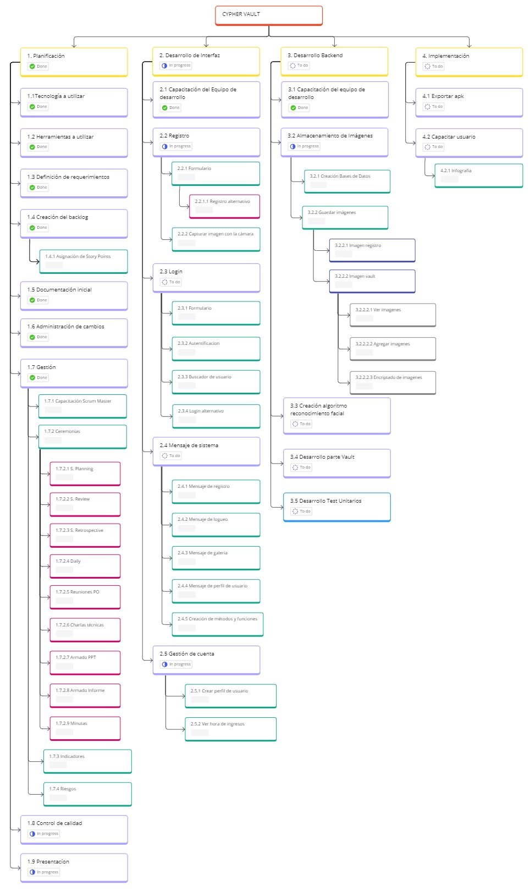
PONER IMAGEN DE LA WBS

=== Diccionario

Los pesos se clasifican en base a:
- 3: Esencial
- 2: Importante
- 1: Deseable

[cols=6*,options=header]
|===
| ID | NOMBRE | DESCRIPCIÓN | TAREA  | RESPONSABLE | PESO
| 1 | Planificación | Planificación sobre las tareas que la componen | Planificación, investigación | Todo el equipo | 3 
| 1.1 | Tecnologías a utilizar | Investigar sobre las tecnologías a utilizar | Investigación | Todo el equipo | 3 
| 1.2 | Herramientas a utilizar | Investigar sobre las herramientas a utilizar | Investigación | Todo el equipo | 3 
| 1.3 | Definición de requerimientos | Definir los requerimientos del proyecto | Documentación | Todo el equipo | 3 
| 1.4 | Creación del backlog | Crear backlog | Planificación  | Scrum Master | 3 
| 1.4.1 | Asignación de Story Points | Estimar esfuerzo de los requerimientos | Planificación, Estimación | Scrum Master | 3 
| 1.5 | Documentación inicial | Crear la documentación | Planificación | Todo el equipo | 3 
| 1.6 | Administración de cambio | Planificar el flujo de los cambios | Planificación | Scrum Master | 2 
| 1.7 | Gestión | Gestión general de indicadores y comunicación del equipo | Planificación, Gestión | Scrum Master | 3 
| 1.7.1 | Capacitación Scrum Master | Capacitación en herramientas de gestión e indicadores | Capacitación | Scrum master | 3 
| 1.7.2 | Ceremonias | Planificación de las ceremonias de Scrum. | Planificación | Scrum Master | 3 
| 1.7.2.1 | Ceremonias | Sprint planning | Planificación | Todo el equipo | 3 
| 1.7.2.2 | Ceremonias | Sprint review | Planificación | Todo el equipo | 3 
| 1.7.2.3 | Ceremonias | Sprint retrospective | Planificación | Todo el equipo | 3 
| 1.7.2.4 | Ceremonias | Daily | Planificación | Todo el equipo | 3 
| 1.7.2.5 | Ceremonias | Reuniones PO | Planificación | Todo el equipo | 3 
| 1.7.2.6 | Ceremonias | Charlas técnicas | Planificación | Todo el equipo | 3 
| 1.7.2.7 | Ceremonias | Armado PPT | Planificación | Todo el equipo | 3 
| 1.7.2.8 | Ceremonias | Armado informe | Planificación | Todo el equipo | 3 
| 1.7.2.9 | Ceremonias | Minutas | Planificación | Todo el equipo | 3 
| 1.7.3 | Indicadores | Control de inidcadores generales | Planificación, Gestión | Scrum Master | 3 
| 1.7.4 | Riesgos | Control e identificación de riesgos | Planificación | Scrum master | 2 
| 1.8 | Control de calidad | Control de calidad | Planificación | Todo el equipo | 3 
| 1.9 | Presentación | presentación de la PPT | Planificación | Todo el equipo |  2
| 2 | Desarrollo de Interfaz | Desarrollar la interfaz | Desarrollo | Equipo de desarrollo | 2 
| 2.1 | Capacitación del Equipo de Desarrollo | Capacitar al equipo con las tecnologías a utilizar | Capacitación | Equipo de desarrollo | 2 
| 2.2 | Registro | Crear interfaz registro | Desarrollo | Equipo de desarrollo | 2 
| 2.2.1 | Formulario | Creación del formulario | Desarrollo | Equipo de desarrollo | 2 
| 2.2.1.1 | Registro alternativo | Creación del registro alternativo | Desarrollo | Equipo de desarrollo | 2 
| 2.2.2 | Capturar imagenes con la cámara | Implementar cámara en interfaz | Desarrollo | Equipo de desarrollo | 2 
| 2.2.3 | Mejoras interfaz registro | Implementar mejoras en la interfaz de registro | Desarrollo | Equipo de desarrollo | 2 
| 2.3 | Login | Implementar interfaz de autentificación | Desarrollo | Equipo de desarrollo | 2 
| 2.3.1 | Formulario | Creación de formulario de autentificación | Desarrollo | Equipo de desarrollo | 2 
| 2.3.2 | Autentificación | Método de autentificación | Desarrollo | Equipo de desarrollo | 2 
| 2.3.3 | Buscador de usuario | Creación de barra de busqueda de usuario | Desarrollo | Equipo de desarrollo | 2 
| 2.3.4 | Login alternativo | Creación del login alternativo | Desarrollo | Equipo de desarrollo | 2
| 2.3.5 | Mejorar interfaz login | Implementar mejoras en la interfaz de login | Desarrollo | Equipo de desarrollo | 2
| 2.3.6 | Comprobación humano vivo | Comprobar que la persona que se logea sea un humano vivo | Desarrollo | Equipo de desarrollo | 2
| 2.4 | Mensaje del sistema | Mensajes del sistema para el usuario | Desarrollo | Equipo de desarrollo | 3
| 2.4.1 | Mensaje de registro | Mensajes del sistema para el registro | Desarrollo | Equipo de desarrollo | 3
| 2.4.2 | Mensaje de logueo | Mensajes del sistema para el logueo | Desarrollo | Equipo de desarrollo | 3
| 2.4.3 | Mensaje de galeria | Mensajes del sistema para la galeria | Desarrollo | Equipo de desarrollo | 3
| 2.4.4 | Mensaje de perfil de usuario | Mensajes del sistema para el perfil del usuario | Desarrollo | Equipo de desarrollo | 3
| 2.4.5 | Creación de metodos y funciones | Creacipon de metodos y funciones para los mensajes del sistema  | Desarrollo | Equipo de desarrollo | 3
| 2.5 | Gestión de cuenta | Gestión para la cuenta del usuario | Desarrollo | Equipo de desarrollo | 3
| 2.5.1 | Crear perfil de usuario | Crear perfil para el usuario | Desarrollo | Equipo de desarrollo | 3
| 2.5.2 | Ver horas de ingreso | Ver horas de ingreso del usuario en su perfil | Desarrollo | Equipo de desarrollo | 3
| 2.5.3 | Cerrar sesión | El usuario puede cerrar sesión | Desarrollo | Equipo de desarrollo | 3
| 2.5.4 | Eliminar cuenta | El usuario puede eliminar su cuenta de manera segura | Desarrollo | Equipo de desarrollo | 3
| 2.5.5 | Cambio de contraseña | El usuario puede cambiar su contraseña | Desarrollo | Equipo de desarrollo | 3
| 2.5.6 | Agregar foto de perfil | El usuario posee una foto de perfil (Misma de registro) | Desarrollo | Equipo de desarrollo | 3
| 2.6 | Premium | El usuario posee funcionalidades de paquete premium | Desarrollo | Equipo de desarrollo | 3
| 2.6.1 | Interfaz opción premium| Preparar la interfaz del paquete premium | Desarrollo | Equipo de desarrollo | 3
| 2.6.2 | Aumentar capacidad de galeria | El usuario tendra mas espacio con el paquete premium | Desarrollo | Equipo de desarrollo | 3
| 3 | Desarrollo backend | Desarrollar la lógica de la aplicación | Desarrollo | Equipo de desarrollo | 3 
| 3.1 | Capacitación del equipo de desarrollo | Capacitar al equipo de desarrollo con las tecnologías a utilizar | Capacitación | Equipo de desarrollo | 2 
| 3.2 | Almacenamiento de imágenes | Almacenar las imágenes en el dispositivo del usuario | Desarrollo | Equipo de desarrollo | 2 
| 3.2.1 | Creación de Base de Datos | Crear base de datos | Desarrollo | Equipo de desarrollo | 2 
| 3.2.2 | Guardar imágenes | Guadar imágenes en la base de datos | Desarrollo | Equipo de desarrollo | 3
| 3.2.2.1 | Imagen registro | Guardar imagenes del registro facial | Desarrollo | Equipo de desarrollo | 3
| 3.2.2.2 | Imagen vault | Guardar imagenes para la galeria | Desarrollo | Equipo de desarrollo | 3
| 3.2.2.2.1 | Ver imagenes | Ver imagenes en la galeria | Desarrollo | Equipo de desarrollo | 3
| 3.2.2.2.2 | Agregar imagenes | Agregar imagenes para la galeria | Desarrollo | Equipo de desarrollo | 3
| 3.2.2.2.3 | Encriptar imagenes | Encriptar imagenes de la galeria | Desarrollo | Equipo de desarrollo | 3
| 3.2.2.2.4 | Capacidad galeria | Limitar la capacidad de la galeria | Desarrollo | Equipo de desarrollo | 3
| 3.2.2.2.5 | Redimencionar imágenes | Redimencionar las imagenes de la galeria | Desarrollo | Equipo de desarrollo | 3
| 3.2.2.2.6 | Eliminar imagen | Eliminar las imagenes de la galeria | Desarrollo | Equipo de desarrollo | 3
| 3.3 | Crear algoritmo reconocimiento facial | Implementación de lógica de reconocimiento facial | Desarrollo | Equipo de desarrollo | 3
| 3.3.1 | Mejoras reconocimiento | Implementación de mejoras en el reconocimiento facial | Desarrollo | Equipo de desarrollo | 3 
| 3.4 | Desarrollo parte Vault | Implementar aplicación de galería privada | Desarrollo | Equipo de desarrollo | 3 
| 3.5 | Test Unitarios | Desarrollar test unitarios | Desarrollo | Equipo de testing | 3 
| 3.6 | Bloqueo de botones del sistema | Bloquear los botones del sistema android | Desarrollo | Equipo de desarrollo | 3 
| 3.7 | Compartir imagen | El usuario podra compartir imagenes con otras personas | Desarrollo | Equipo de desarrollo | 3 
| 3.7.1 | Generar QR | Crear QR para que el usuario pueda escanearlo y ver la imagen  | Desarrollo | Equipo de desarrollo | 3 
| 3.7.2 | Crear servidor | Crear servidor donde se alojaran los datos necesarios | Desarrollo | Equipo de desarrollo | 3 
| 3.7.3 | Emparejar usuario | Emparejar la cuenta del usuario al servidor | Desarrollo | Equipo de desarrollo | 3 
| 3.7.4 | Crear la página de visualización | Crear la página donde la persona podra ver la imagen compartida | Desarrollo | Equipo de desarrollo | 3 
| 3.7.5 | Lógica de la página de visualización | Crear la lógica para la página de visualización de la imagen | Desarrollo | Equipo de desarrollo | 3 
| 3.7.6 | Hosteo de página | Hostearla página para la visualización de la imagen compartida | Desarrollo | Equipo de desarrollo | 3 
| 3.8 | Doble autenticación | El sistema cuenta con doble autenticación para mas seguridad | Desarrollo | Equipo de desarrollo | 3 
| 3.8.1 | Interfaz doble autenticación | Crear la interfaz para la doble autenticación | Desarrollo | Equipo de desarrollo | 3 
| 3.8.2 | Integración doble autenticación | Integrar la doble autenticación al sistema | Desarrollo | Equipo de desarrollo | 3 
| 3.8.3 | Generación de código | Generar un código se seguridad para el ingreso a la aplicación | Desarrollo | Equipo de desarrollo | 3 
| 3.8.4 | Envio de mail | Enviar un mail con el código generado | Desarrollo | Equipo de desarrollo | 3 
| 3.8.5 | Ingreso de código | Crear la funcionalidad para ingresar el código y poder loguearse | Desarrollo | Equipo de desarrollo | 3 
| 3.8.6 | Interfaz código | Crear la interfaz para ingresar el código | Desarrollo | Equipo de desarrollo | 3 
| 3.8.7 | Interfaz rango horario | Crear la interfaz para los botones de rango horario | Desarrollo | Equipo de desarrollo | 3 
| 3.8.8 | Funcionalidad botones rango horario | Crear la funcionalidad para ingresar por el rango horario | Desarrollo | Equipo de desarrollo | 3 
| 3.8.9 | Habiulitar/Deshabilitar doble autenticación | Crear la funcionalidad para habilitar o deshabilitar la doble autenticación | Desarrollo | Equipo de desarrollo | 3 
| 4 | Implementación | Puesta en servicio de la aplicación | Implementación | Capacitador y Prueba de Usuario, Equipo de desarrollo | 2 
| 4.1 | Exportar apk | Compilación del proyecto a formato de dispositivo android | Implementación | Equipo de desarrollo | 2 
| 4.2 | Capacitar usuario | Capacitar a usuario final | Capacitación | Capacitador y Prueba de Usuario | 2 
| 4.2.1 | Infografía | Mostrar imagen de uso | Capacitación | Capacitador y Prueba de Usuario | 2 
|===

=== Calendario

[cols=3*,options=header]
|===
| Entrega | Fecha | Tareas 
| 1 | (19/4)| Presentación de Plan de Proyecto
| 2 | (26/4) | Implementacion de interfaz inicial
| 3 | (8/5) | Implementación de algoritmo de reconocimiento facial
| 4 | (22/5) | Interfaz galeria, ver imagenes, cargar imagenes, guardar datos de ingreso, implementar mensajes de registro y logueo
| 5 | (5/6) | Agregar foto de perfil, Cambiar contraseña, Cerrar sesión, Eliminar cuenta, Implementar mensajes de perfil de usuario y galeria, Cifrar imagenes
| 6 | (14/6) | A definir 
| 7 | (26/6) | A definir 
|===

=== Estimaciones Iniciales

Se entregará un prototipo de la interfaz funcional para el registro, la autentificación y base de datos. Estimamos que el tiempo empleado será:

* *Capacitación del equipo en las tecnologías:* 5hs por cada desarrollador y tester.
* *Desarrollo:* 20hs por cada desarrollador.
* *Testing:* 10hs por tester.

=== Estimaciones Sprint 1

* *Scrum Master:* 4hs
* *Desarrollador:* 18hs por cada uno
* *Tester:* 8hs por cada uno

=== Estimaciones Sprint 2

* *Scrum Master:* 29hs
* *Desarrollador:* 64hs en total
* *Tester:* 37hs en total

=== Estimaciones Sprint 3

* *Scrum Master:* 40hs
* *Desarrollador:* 145hs en total
* *Tester:* 78hs en total

=== Estimaciones Sprint 4

* *Scrum Master:* 40hs
* *Desarrollador:* 145hs en total
* *Tester:* 78hs en total

=== Estimaciones Sprint 5

* *Scrum Master:* 25hs
* *Desarrollador:* 95hs en total
* *Tester:* 49hs en total

=== Horas empleadas Sprint 1

* *Capacitación del equipo en las tecnologías:* 10hs por cada desarrollador y tester.
* *Desarrollo:* 25hs por cada desarrollador.
* *Testing:* 2hs por tester.
* *Ceremonias y reuniones técnicas:* 15hs con todo el equipo presente

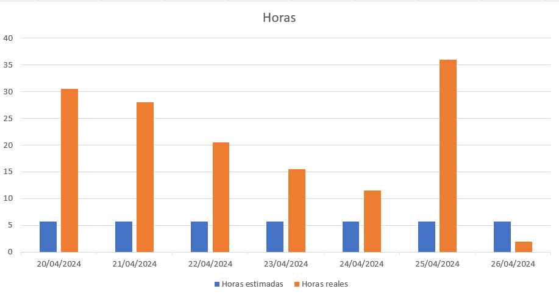

=== Horas empleadas Sprint 2

* *Srum Master:* 29hs
* *Desarrollo:* 120hs en total
* *Testing:* 40hs por tester.

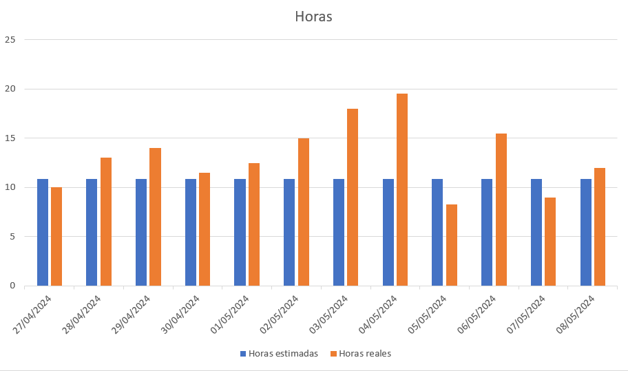

=== Horas empleadas Sprint 3

* *Srum Master:* 29hs
* *Desarrollo:* 120hs en total
* *Testing:* 40hs por tester.

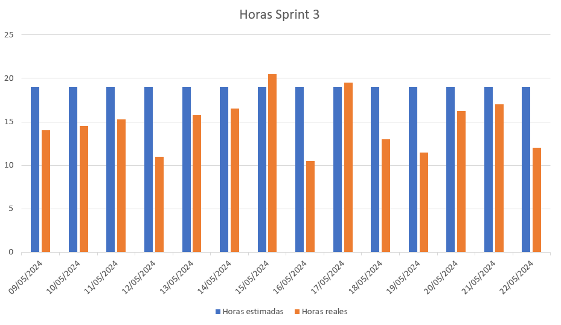

=== Horas empleadas Sprint 4

* *Srum Master:* 29hs
* *Desarrollo:* 120hs en total
* *Testing:* 40hs por tester.

PONER IMAGEN HORAS SPRINT 4

=== Horas empleadas Acumuladas

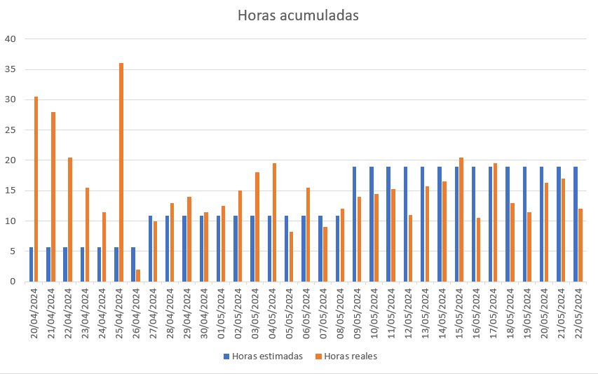

PONER IMAGEN HORAS ACUMULADAS

=== Riesgos

* R1 Falta de claridad en los objetivos
* R2 Escasez de práctica en la gestión de proyectos
* R3 Constantes modificaciones en los requerimientos
* R4 Ausencia de un miembro del equipo
* R5 Tensiones comunicativas dentro del equipo
* R6 Estimación  erroneas debido a la falta de experiencia
* R7 La curva de aprendizaje en nuevas tecnologias podria afectar la eficiencia de los desarrolladores
* R8 Variación en los tiempos de dedicación entre los miembros del equipo

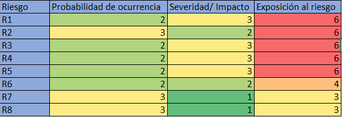

** Plan de mitigacion
* R1 = Armado detallado de la WBS. Organizar reuniones para revisar y aclarar los objetivos.
* R2 = Documentar las lecciones aprendidas durante el proyecto. Contar con miembros experimentados que brinde asistencia y orientacion al equipo
* R3 = Investigar y comunicarse con las autoridades reguladoras pertinentes
* R4 = Designar roles suplentes para asegurar la continuidad del trabajo en caso de ausencia de algun miembro
* R5 = Programar reuniones periodicas y practicar la escucha activa durante las interacciones
* R6 = Realizar estimaciones realistas teniendo en cuenta la experiencia del equipo y los recursos disponibles, utilizando enfoques de metodologias apropiadas
* R7 = Investigar , evaluar y capacitarse en nuevas tecnologias antes de su implementacion en el proyecto
* R8 = Elaborar un calendario que refleje los horarios disponibles de cada miembro del equipo

** Plan de contingencia

* R1 = Definir y compartir los objetivos del proyecto de manera clara en todo el equipo
* R2 = Ampliar conocimientos tanto mediante la teoria como consultando a profesores
* R3 = Adaptarse a los nuevos cambios que surjan durante el proyecto.
* R4 = Brindar apoyo a los compañeros que enfrenten dificultades personales y, de ser necesario, redistribuir tareas
* R5 = Asignar un mediador para resolver los conflictos internos de manera efectiva
* R6 = Establecer un margen de contingencia para hacer frente a situaciones imprevistas.  Aprender de tareas realizadas previamente.
* R7 = Falicitar la tranferencia de conocimiento mediante la colaboracion de un miembro mas experimentado
* R8 = Adaptar las tareas según el ritmo de trabajo y conocimiento de cada miembro del equipo

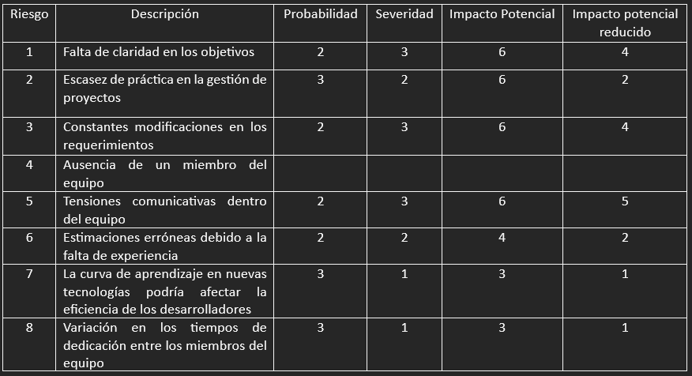

** Plan de mitigación sprint 2

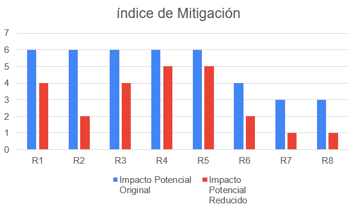

** Plan de mitigación sprint 3

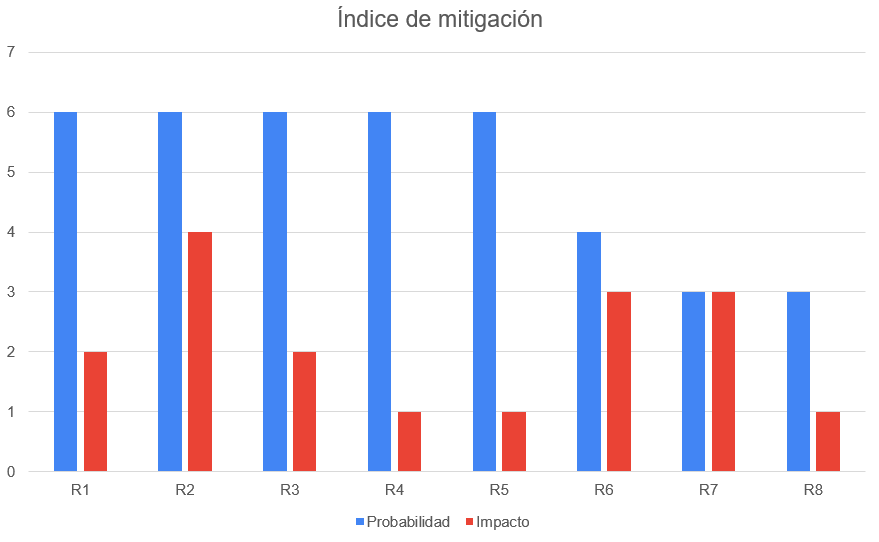

** Plan de mitigación sprint 4

PONER IMAGEN PLAN DE MITIGACION SPRINT 4
 
=== Entregables

Definimos los hitos que ocurrirán en las diferentes fechas del proyecto. El primer hito se enfocará en la presentación formal del proyecto al cliente. En esta se explicará el plan de gestión que tendremos para administrar el proyecto.
En los hitos restantes se presentará al cliente los avances en el producto.

* Presentación del proyecto el día 19/04
* Reunión formal 1 el día 26/04
* Reunión formal 2 el día 8/05
* Reunión formal 3 el día 22/05
* Reunión formal 4 el día 5/06
* Reunión formal 5 el día 14/06
* Presentación final el día 26/06

** Entregables para el proximo sprint del dia 8/05:
* Resolución de bugs del sprint anterior
* Investigación de reconocimiento facial
* Mejoras en interfaz 
* Implementación y desarrollo de algoritmo de reconocimiento facial (deseable)

** Entregables para el proximo sprint del dia 22/05:
* Armado interfaz de galeria
* Ver imagenes de la tablet en la aplicación
* Guardar datos de ingreso
* Implementar mensajes de Registro y logueo

** Entregables para el proximo sprint del dia 05/06:
* Agregar foto de perfil
* Cambiar contraseña
* Cerrar sesión
* Eliminar cuenta
* Implementar mensajes de perfil de usuario y galeria
* Cifrar imagenes

** Entregables para el proximo sprint del dia 14/06:
* Compartir imágenes
* 
* 
* 
* 
* 

=== Administración en el Manejo de Bugs

Ejecutar una gestión eficaz de errores y pruebas es un componente esencial en un sistema de software. Estas tareas son vitales para asegurar que el sistema opere de forma fiable, eficiente y satisfaga las necesidades de los usuarios.

WARNING: *Haremos un seguimiento de los errores en una planilla de excel en un drive compartido con todo el equipo en el cual se detalla fecha de descubrimiento, funcionalidad afectada, tester que lo identifico, desarrollador responsable, detalle del bug, estado y fecha de cierre.
Los categorizaremos en tres niveles de acuerdo a su severidad: bajo, medio o alto. Esto nos permitirá determinar cuáles son las dificultades más urgentes y cuáles son de menor prioridad.*

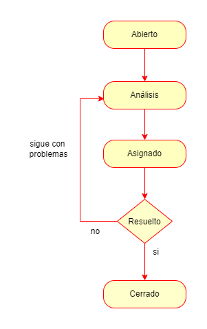

Los bugs, se identificaron a través de la ejecución de pruebas. Dichas pruebas se llevaron a cabo utilizando como referencia las tablas de equivalencia que se detallan a continuación.

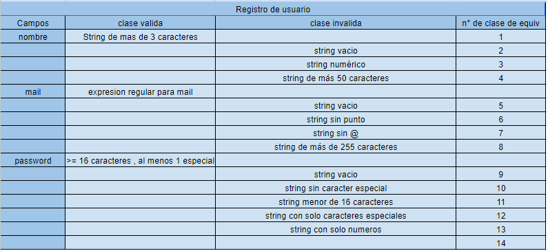

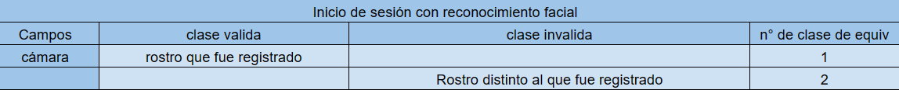

PONER TABLA DE EQUIVALENCIA

=== Administración de Cambios

La adecuada administración de cambios es crucial para el éxito de cualquier proyecto. Los cambios pueden surgir por distintos motivos, como nuevos requerimientos del cliente, descubrimientos durante el desarrollo, o variaciones en las condiciones del mercado.

Para documentar los cambios se emplearán:

* Informe de avance: se mantendrá actualizado un informe de avance que puede incluir un registro de todos los cambios. Además, se registrarán los cambios en las minutas de las reuniones.

* Trello: como se mencionó previamente, será nuestra principal plataforma para el seguimiento y gestión de cambios.

Aprobación o rechazo de cambios: Un comité de cambios evaluará cada solicitud de cambio basándose en los siguientes factores:

** Cronograma: se considerará si el cambio afecta al cronograma del proyecto. Aquellos cambios que impacten serán evaluados en función de su urgencia y prioridad.

** Alcance: se analizará si el cambio está en línea con los objetivos y el alcance del proyecto.

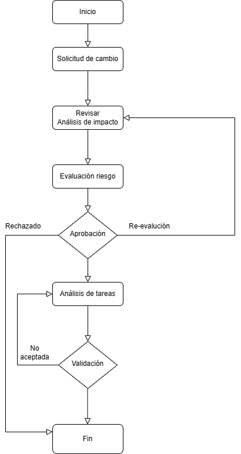

=== Indicadores

* Funcionalidad Completa Sprint 1

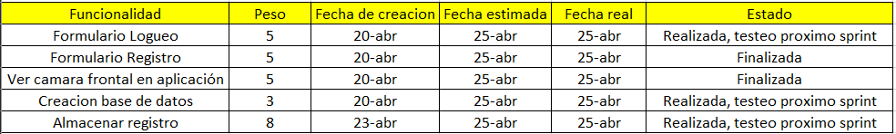

* Nivel de Calidad Sprint 1
* Evolución de la Prueba Sprint 1

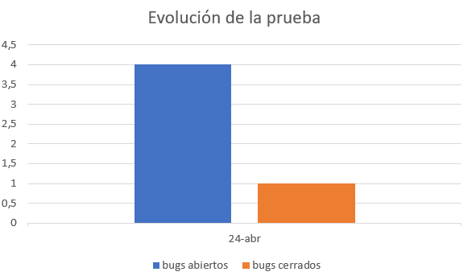

* Burndown Chart Sprint 1

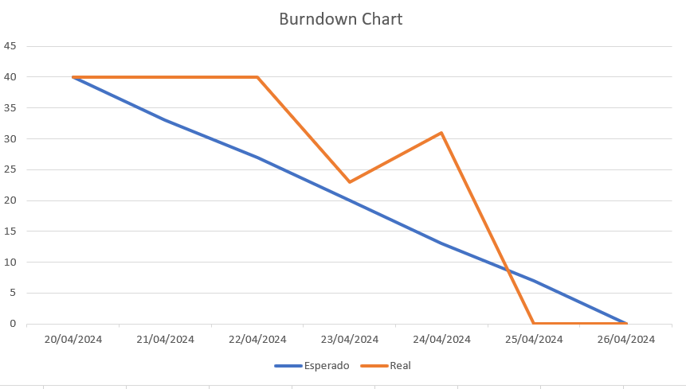

* Funcionalidad Completa Sprint 2

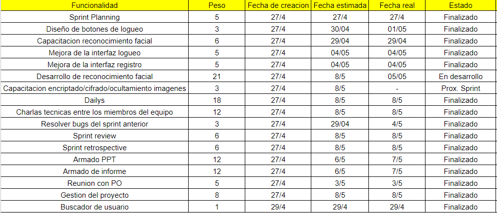

* Nivel de Calidad Sprint 2

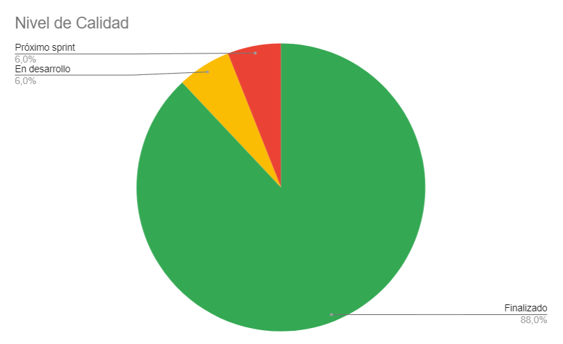

* Evolución de la Prueba Sprint 2

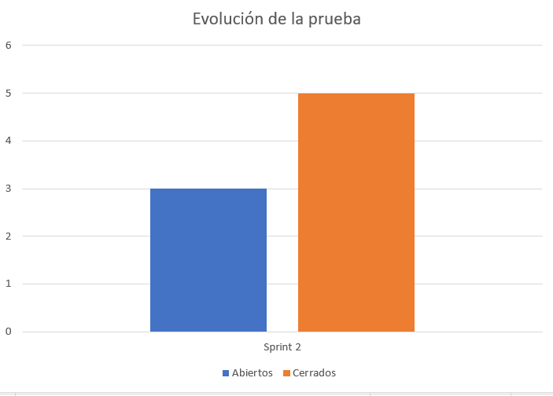

* Burndown Chart Sprint 2

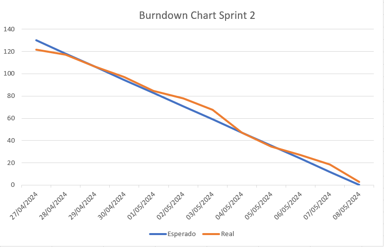

* Funcionalidad Completa Sprint 3

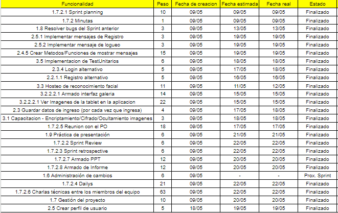

* Nivel de Calidad Sprint 3

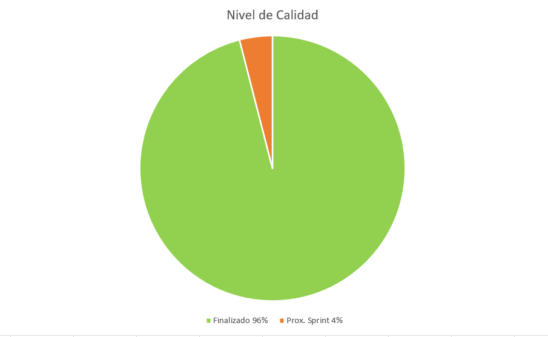

* Evolución de la Prueba Sprint 3

image::Recursos/Sprint 3/Evolucion de la prueba sprint 3.PNG[700,700]

* Burndown Chart Sprint 3

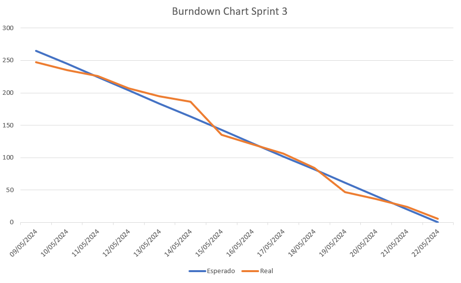

* Funcionalidad Completa Sprint 4

PONER IMAGEN FUNCIONALIDAD COMPLETA 4

* Nivel de Calidad Sprint 4

PONER IMAGEN NIVEL DE CALIDAD SPRINT 4

* Evolución de la Prueba Sprint 4

PONER IMAGEN EVOLUCION DE LA PRUEBA SPRINT 4

* Burndown Chart Sprint 4

PONER IMANGEN BURNDOWN CHART SPRINT 4

=== Indicadores Acumulados

* Evolución de la Prueba Acumulado

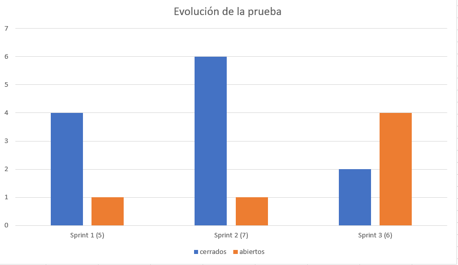
PONER IMAGEN EVOLUCION DE LA PRUEBA ACUMULADO

* Burndown Chart Acumulado

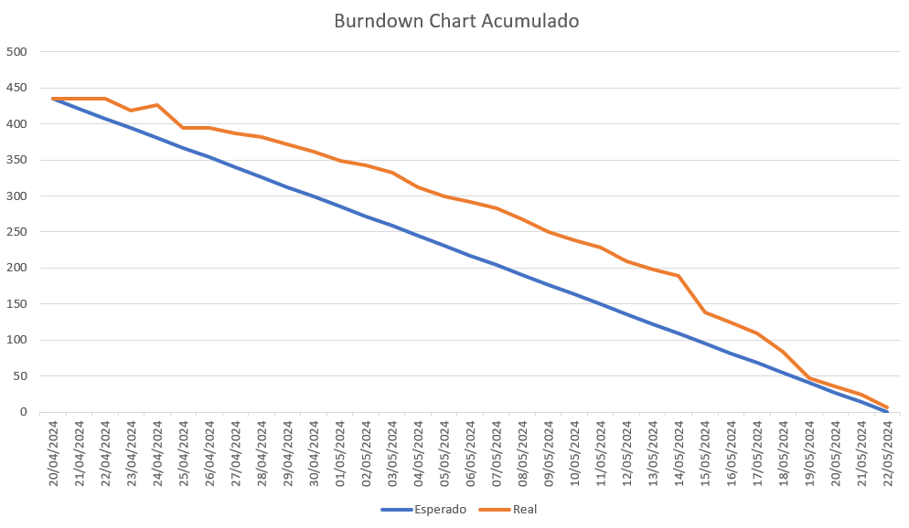
PONER IMAGEN BURNDOWN CHART ACUMULADO

=== Problemas encontrados

* Organización de las tareas:
Uno de los desafíos que enfrentamos se relacionó con la organización de las tareas. Al inicio del ciclo de desarrollo, habíamos establecido un plan de ejecución detallado que especificaba el orden y la duración estimada de cada tarea. Sin embargo, durante el transcurso del sprint, no se mantuvo la secuencia originalmente planificada. Este desvío en el orden de ejecución conllevó a una fase final del sprint caracterizada por un ritmo acelerado y una relativa falta de estructura en la ejecución de las tareas.

* Poca o nula experiencia en nuevas tecnologías:
La falta de familiaridad con las tecnologías aplicadas en el proyecto planteó un desafío significativo para ambos equipos, tanto de desarrollo como de Testing, en la resolución de problemas emergentes. Este escenario resultó en una utilización menos eficiente del tiempo asignado a cada tarea, lo cual impactó en la productividad general del equipo.

* Ausencia de miembro por problemas de salud:
Durante la ejecución del sprint 3, uno de los miembros del equipo estuvo ausente un día debido a problemas de salud. Aunque no se produjo un retraso en la implementación de la funcionalidad en desarrollo, se identificó la posibilidad de que este contratiempo pudiera haber tenido consecuencias más graves, comprometiendo así la calidad del producto final en el momento de su entrega.

* Falta de servicio de luz:
Durante la ejecución del proyecto, nos enfrentamos a contratiempos relacionados con la interrupción del suministro eléctrico. En varios días, algunos miembros del equipo se vieron imposibilitados de avanzar en sus tareas debido a la falta de energía eléctrica.

=== Lecciones aprendidas:

* Planificación y gestión de proyecto:
Utilizando los conceptos aprendidos en la teoría, pudimos llevar a cabo la planificación del proyecto de manera efectiva. Desde una etapa temprana, definimos los objetivos y alcance, así como los requerimientos, el gestionamiento anticipado de los riesgos y los posibles cambios, establecimos roles y responsabilidades del equipo para facilitar la coordinación y colaboración. Además, gestionar el proyecto nos permitió estructurar las tareas en sprints y optimizar los recursos para alcanzar los objetivos y plazos, garantizando la calidad del producto y la satisfacción del cliente.

* Comunicación entre los miembros del equipo:
Dentro del marco de la metodología Scrum, se promueve una comunicación abierta y transparente sobre el progreso del trabajo, los desafíos encontrados y las posibles adaptaciones para optimizar el proceso. La sincronización entre los miembros del equipo resulta crucial para el éxito del proyecto, permitiendo una colaboración efectiva y una respuesta ágil ante los cambios y desafíos que puedan surgir.

=== Tecnologías

* *Android Studio:* Es un entorno de desarrollo integrado gratuito diseñado específicamente para el desarrollo de aplicaciones Android. 
* *Kotlin:* Kotlin Es un lenguaje de programación de código abierto para aplicaciones Android.
* *OpenCV:* Es una biblioteca que proporciona una amplia gama de funciones y algoritmos para el procesamiento de imágenes y vídeo
* *TensorFlow Lite* TensorFlow Lite es un marco de trabajo ligero desarrollado por Google que permite ejecutar modelos de aprendizaje automático en dispositivos móviles e integrados.
* *SQLite:* SQLite es un sistema de gestión de bases de datos relacional (RDBMS) ligero, rápido, autónomo y de código abierto.
* *Python:* Lenguaje de programación de código abierto.
* *Flask:* Es un microframework de Python que proporciona las herramientas necesarias para construir una aplicación web.

NOTE: *Continua:* por motivos de estetica y facil acceso se implementa dentro del indice Herramientas / Implementacion.

== Herramientas / Implementacion

=== Visual Studio Code

image::imagenAdoc/logovisualstudio.png[100,100]

Fuente: link:https://visualstudio.microsoft.com/es/[Microsoft.com/VisualStudio]

*Dentro del proyecto su uso no es primario, pero si se utiliza para revisar las clases dentro del proyecto de Android Studio, por otro lado es una gran herramienta a la hora de confeccionar el informe / documentacion del proyecto.*

Editor de código fuente independiente que se ejecuta en Windows, macOS y Linux. El IDE de Visual Studio es una plataforma de lanzamiento creativa que puede utilizar para editar, depurar y compilar código y, finalmente, publicar una aplicación. Además del editor y depurador estándar que ofrecen la mayoría de IDE, Visual Studio incluye compiladores, herramientas de completado de código, diseñadores gráficos y muchas más funciones para mejorar el proceso de desarrollo de software.

=== Android Studio 

image::imagenAdoc/logoandroidstudio.png[200,200]

Fuente: link:https://developer.android.com/studio?hl=es-419[android.com/developer]

*Es la herramienta principal del desarrollo de la aplicacion, el mismo es un IDE robusto el cual cuenta con varias funcionalidades las cuales acompañan las etapas de desarrollo, depuracion, testeo e implementacion.*

Entorno de desarrollo integrado (IDE) oficial del desarrollo de apps para Android. Basado en el potente editor de código y las herramientas para desarrolladores de IntelliJ IDEA, Android Studio ofrece aún más funciones que mejoran tu productividad cuando compilas apps para Android, como las siguientes:

* Un sistema de compilación flexible basado en Gradle
* Un emulador rápido y cargado de funciones
* Un entorno unificado donde puedes desarrollar para todos los dispositivos Android
* Ediciones en vivo para actualizar elementos componibles en emuladores y dispositivos físicos, en tiempo real
* Integración con GitHub y plantillas de código para ayudarte a compilar funciones de apps comunes y también importar código de muestra
Variedad de marcos de trabajo y herramientas de prueba
* Herramientas de Lint para identificar problemas de rendimiento, usabilidad y compatibilidad de versiones, entre otros
* Compatibilidad con C++ y NDK
* Compatibilidad integrada con Google Cloud Platform, que facilita la integración con Google Cloud Messaging y App Engine.

NOTE: *Aclaracion:* Dentro del equipo de desarrollo y testeo utilizamos los mismos dispositivos celulares para emular y testear la implementacion/desarrollo, ya que en algunos casos es imposible por las capacidades computacionales de los equipos ( computadoras ) de cada uno de los integrantes.

=== Implementacion

*En esta seccion se pasa a detallar cada una de las partes del desarrollo, junto a sus herramientas, ya que dentro de android studio como se detallo anteriormente se encuentran funcionalidades especificas.*

Para comenzar nos encontramos con el ultimo IDE estable lanzado por Android, el cual es la version Iguana, luego se creo un proyecto con la version minima compatible recomendada por el mismo. Teniendo esto en cuenta nuestra aplicacion es compatible desde Android 7 hasta la ultima version lanzada al dia de hoy.

NOTE: *¿Por que no versiones anteriores?:* Porque esto genera problemas en las dependencias ( funcionalidades ofrecidas por android ) disponibles, lo cual provoca que la aplicacion pierda posibilidades de escalado, ya que hay versiones anteriores que resultan incompatibles con las mismas dependencias..

*Modelo de diseño*

Fuente: link:https://barcelonageeks.com/patron-de-arquitectura-mvvm-model-view-viewmodel-en-android/[barcelonageeks.com/mvvm]

* Al organizar los códigos de acuerdo con un patrón de diseño, ayuda en el mantenimiento del software. Al tener conocimiento de todas las partes lógicas cruciales de la aplicación de Android , es más fácil agregar y eliminar funciones de la aplicación. Además, los patrones de diseño también aseguran que todos los códigos se cubran en las pruebas unitarias sin la interferencia de otras clases. Model — View — ViewModel (MVVM) es el patrón de arquitectura de software reconocido en la industria que supera todos los inconvenientes de los patrones de diseño MVP y MVC . MVVM sugiere separar la lógica de presentación de datos (vistas o interfaz de usuario) de la parte lógica empresarial central de la aplicación. 

* Las capas de código separadas de MVVM son:
** *Modelo:* esta capa es responsable de la abstracción de las fuentes de datos. Model y ViewModel trabajan juntos para obtener y guardar los datos.
** *Vista:* El propósito de esta capa es informar al ViewModel sobre la acción del usuario. Esta capa observa el ViewModel y no contiene ningún tipo de lógica de aplicación.
** *ViewModel:* Expone esos flujos de datos que son relevantes para la Vista. Además, sirve como enlace entre el Modelo y la Vista.

image::imagenAdoc/mvvm.png[700,700]

* El patrón MVVM tiene algunas similitudes con el patrón de diseño MVP (Modelo, Vista, Presentador) ya que ViewModel desempeña el rol de Presentador. Sin embargo, los inconvenientes del patrón MVP han sido resueltos por MVVM de las siguientes maneras:

** ViewModel no contiene ningún tipo de referencia a la Vista.
** Existe una relación de muchos a 1 entre View y ViewModel.
** No hay métodos de activación para actualizar la Vista.

=== Interfaz

Fuente: link:https://developer.android.com/develop/ui/compose[android.com/compose]

Fuente: link:https://developer.android.com/reference/androidx/navigation/NavController[android.com/nav_controller]

Fuente: link:https://developer.android.com/reference/kotlin/androidx/compose/runtime/Composable[android.com/composable]

Fuente: link:https://developer.android.com/reference/android/util/Patterns[android.com/patterns]

El código se divide en tres paquetes que se encuentran en `app > src > main > java > com.example.cypher_vault`. Acá hay dos paquetes: uno llamado 'controller' y otro llamado 'view'.

*Paquete Controller > Authentication*

** AuthenticationController.kt
*** `AuthenticationController` es una clase que toma como parámetro un `NavController` y devuelve el `NavController` con la dirección a la que debe navegar. 
Cada dirección tiene su propia función: `fun navigateToCamera()`, `fun navigateToConfirmation()`, `fun navigateToLogin()` (esta última falta implementar).

[source,kotlin]
----
fun registerUser( # <1>
        email: String,
        name: String,
        showDialog: MutableState<Boolean>,
        errorMessage: MutableState<String>
    )
----
<1> La función `registerUser` valida los campos por el momento. Más adelante deberá enviarlos al modelo para guardarlos en la base de datos. 
Recibe como parámetros `email`, `name`, `showDialog` y `errorMessage`. Estos parámetros son para que salga la alerta y mostrarla con sus respectivos mensajes.
Si todos los campos están bien, llama a `navigateToCamera` y los manda a la cámara.

* Las funciones `validateMail()`, `validateName()` y `validateFields` verifican la validez de los campos de entrada.
** `validateMail(email: String)`: Se fija que se cumpla android.util.Patterns.EMAIL_ADDRESS.matcher(email).
** `validateName(name: String)`: Se fija que no tenga menos de 3 carácteres el nombre.
** `validateFields(name: String, email: String)`: Se fija que no esten vacios.

*Paquete View > Registration*

.NavigationHost.kt
[source,kotlin]
----
fun NavigationHost() # <1>
----
<1> `NavigationHost()` es una función que se utiliza para manejar la navegación en la aplicación, cada vez que se presiona un botón cambia las pantallas. 

NOTE: *Aclaracion:* Empieza en register por predeterminado y luego va cambiando, toma como parámetro las direcciones que le pasa el AuthenticationController, .

* **Definición de pantallas**: Dentro de esta función `NavHost`, se definen varias pantallas que representan diferentes partes:
** *register*: Esta es la pantalla inicial donde los usuarios pueden registrarse. Muestra `InitialScreen`.
** *camera* Esta es la pantalla donde los usuarios pueden usar la cámara durante el proceso de registro. Muestra `RegistrationCameraScreen`.
** *confirmation*: Esta es la pantalla donde los usuarios pueden confirmar su registro. Muestra `ConfirmationScreen`.
** *login*: Esta es la pantalla donde los usuarios pueden iniciar sesión. Falta implementar.

.InitialScreen.kt
[source,kotlin]
----
fun RegistrationCameraScreen(authenticationController: AuthenticationController) # <1>
----
<1> Recibe como parametro authenticationController para luego poder navegar por la aplicacion

`InitialScreen` es la pantalla inicial donde los usuarios se van a registrar. Se encuentran los campos de entrada para el correo electrónico y el nombre. Al hacer clic en el botón "Registrarse", se llama al método `registerUser` del 
`AuthenticationController`.

.RegistrationCameraScreen.kt
[source,kotlin]
----
fun RegistrationCameraScreen(authenticationController: AuthenticationController) # <1>
----
<1> Recibe como parametro authenticationController para luego poder navegar por la aplicacion

Esta función Muestra la vista previa de la cámara
`ProcessCameraProvider:` Esta es una clase que se utiliza para interactuar con las cámaras disponibles en el dispositivo. En este caso, se obtiene una instancia de ProcessCameraProvider y 
se recuerda para su uso posterior.

`CameraSelector:` Esta es una clase que se utiliza para seleccionar una cámara en el dispositivo. En este caso, se está seleccionando la cámara frontal.

[source,kotlin]
----
fun CloseCameraButton(isCameraOpen: MutableState<Boolean>,
                      cameraProvider: ProcessCameraProvider,
                        authenticationController: AuthenticationController) # <1>
----
<1> Botón que se muestra para cerrar la cámara e ir a la parte de ConfirmationScreen

[source,kotlin]
----
fun CameraPreview(preview: Preview) # <1>
----
<1> Muestra la vista previa de la cámara en la interfaz de usuario. Utiliza la clase AndroidView para mostrar la vista previa de la cámara en la interfaz de usuario de Compose.

.ConfirmationScreen.kt
[source,kotlin]
----
fun ConfirmationScreen(authenticationController: AuthenticationController) # <1>
----
<1> Recibe como parametro authenticationController para luego poder navegar por la aplicacion

`ConfirmationScreen` Es una pantalla que muestra un mensaje de que se pudo registrar y un botón para iniciar sesión

*Paquete View > Login*

.LoginList.kt
[source,kotlin]
----
fun NavigationLogin(authenticationController: AuthenticationController) # <1>
----
<1> `NavigationLogin()`: Esta función se encarga de mostrar un lista de los usuarios que ya están registrados en la aplicación. Permite a los usuarios navegar a través de sus cuentas de forma eficiente.  

[source,kotlin]
----
fun loginCamera(authenticationController: AuthenticationController, user: String) # <1>
----
<1> La función `loginCamera` se activa después de que el usuario ha seleccionado su cuenta. Su propósito es encender la cámara frontal para realizar una verificación biométrica,asegurándose de que la cuenta seleccionada pertenezca realmente al usuario en cuestión. Esta validación permite mantener la seguridad y la integridad de la cuenta.

[source,kotlin]
----
fun CloseCameraButton(cameraProvider: ProcessCameraProvider, authenticationController: AuthenticationController) # <1>
----
<1> La función `CloseCameraButton` permite al usuario cerrar la cámara frontal si se ha seleccionado una cuenta incorrecta. Ofrece una interfaz para regresar de manera rápida al inicio de sesión, específicamente a la pantalla de `NavigationLogin`, facilitando el desplazamiento dentro de la aplicación.

=== Mejora de interfaz

==== Cambio de tipo de letra

** Elección del tipo de letra: Se selecciono la fuente de tipo `consola` para nuestra aplicación, ya que proporciona una estética adecuada y profesional para nuestra aplicación.

** Color de Letra: El color seleccionado para el texto es un tono celeste, que no solo combina con el logotipo de nuestra aplicación, sino que también mejora la visibilidad y el contraste, facilitando la lectura y escritura.

NOTE: *Aclaracion:* La uniformidad en el tamaño de los caracteres de la fuente `consola`, independientemente de que sean mayúsculas o minúsculas, nos permite calcular con precisión la longitud de los textos. Esto es especialmente útil para optimizar el espacio disponible dentro de los botones de inicio de sección, donde se mostrarán el nombre de usuario y su correo electrónico correspondiente. 

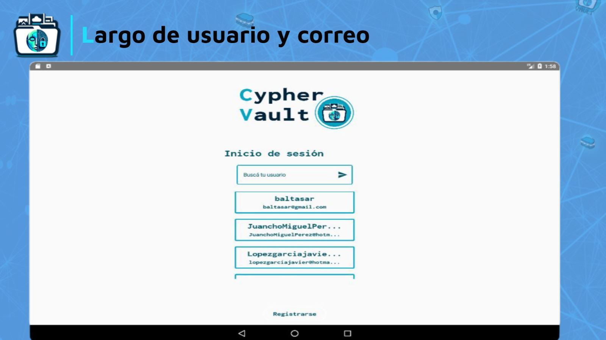

==== Cambios de botones

** Estética: Se implementó un nuevo diseño para los botones, optando por formas más cuadradas en lugar de redondeadas, Esto amplía el ancho de los botones, permitiendo así un espacio adecuado para ingresar tanto el nombre de usuario como el correo electrónico.

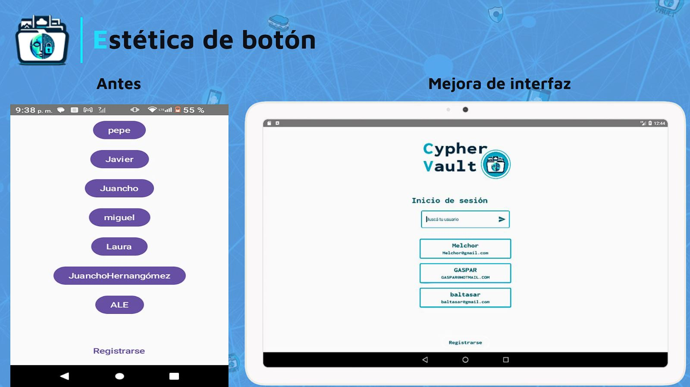

** Tipografía: Continuamos utilizando la fuente Consola por su claridad y hemos incrementado el tamaño de la letra del nombre de usuario para mejorar la legibilidad.

** Organización de la Información: El correo electrónico del usuario ahora se muestra debajo del nombre, pero con un tamaño menor que el nombre de usuario, lo que facilita la distinción entre usuarios con nombres idénticos, ya que sus correos serán únicos.

==== Sócalo de sistema
** Espacio de Mensajes: Se ha diseñado un área específica para mensajes del sistema que orientará al usuario durante el proceso de registro, informando sobre cualquier incidencia. Este sócalo de sistema se ha incluido como una característica deseable en la tarjeta de diseño 2.5.

==== Optimización del Buscador de Usuarios:
** Búsqueda por Nombre de Cuenta: Hemos integrado una función de búsqueda que permite localizar una cuenta de usuario específica mediante su nombre. Esta herramienta es especialmente útil en situaciones donde hay numerosas cuentas, simplificando así la experiencia del usuario al identificar y acceder a la cuenta deseada con mayor rapidez y eficiencia

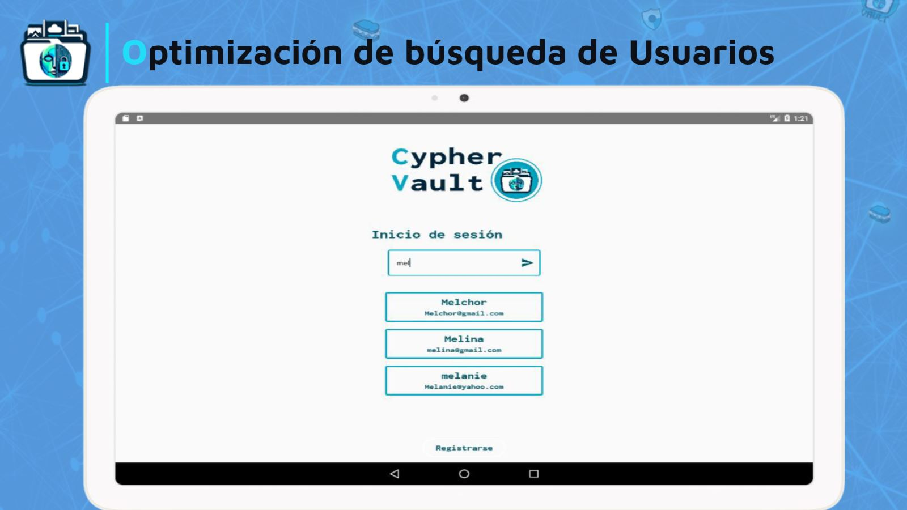

==== Logo de la aplicación

** El logo de aplicación se ha incorporado tanto en la pantalla de registro como en la de inicio de sección, aportando una imagen más profesional al diseño general.

image::Recursos/mejora_De_Interfaz/logo-de-la-app.JPG[]

=== Zócalo de Mensaje

==== Objetivo
** Los zócalos de mensajes son elementos importante en nuestra aplicación, estan diseñados para proporcionar orientación y mejorar la experiencia del usuario. A continuación, se explicara su objetivos y los diferentes iconos que encontrarás en nuestra aplicacion:

==== Iconos de mensaje
** En nuestra aplicación, utilizamos tres tipos de iconos de mensaje para comunicar diferentes situaciones a los usuarios cuando realizan un acción.

** Tiene como objetivo proporcionar una guía al usuario sobre cómo completar un campo específico. Es una forma de aclarar el propósito del campo y aconsejar al usuario.

image::Recursos/iconos-msg-03.png[]
** Este icono tiene como objetivo indicar precaución. Aparece cuando existen campos que no se están completando correctamente o cuando algo podría fallar. Es una señal para que el usuario revise la información antes de continuar.

** Este icono tiene como objetivo indicar un error cuando el usuario completa un campo de manera erronea.

==== Vista registration
** Registration: En la sección de registro, hay tres campos obligatorios que se deben completar: `correo electrónico`, `nombre de usuario` y `contraseña`. Para completar estos campos, se requieren ciertas condiciones.

==== Campo de Correo Electrónico 
** En el campo de Correo Electrónico, se le solicitará al usuario que proporcione una dirección de correo válida para completar su registro. Si el usuario ingresa un correo incorrecto, pueden aparecer los siguientes mensajes:

image::Recursos/combinacionDeMensajes/diapositiva(Correo).JPG[700,700]
** Como se puede apreciar en la imagen, existen varios tipos de mensajes, los posibles mensajes son:

*** Mensaje Principal: Este mensaje estará activo hasta que el usuario ingrese un correo válido. Sirve como recordatorio para completar correctamente el campo.

*** Correo con Espacio: Si el usuario ingresa un correo con espacios, se mostrará un mensaje indicando que no se permite el uso de espacios. Además, el texto ingresado por el usuario se resaltará en rojo, lo que señala que algo está fallando.

*** Correo Registrado: Si un usuario ya se ha registrado con la dirección de correo proporcionada, se mostrará un mensaje informando que ese correo ya está en uso. En este caso, el usuario deberá ingresar una dirección diferente.

*** Correo Válido: Cuando el usuario completa correctamente el campo con una dirección de correo válida, todos los mensajes desaparecerán, indicando que se ha ingresado el correo correctamente.

==== Campo de Nombre

** En esta sección se le pedirá al usuario un nombre para su cuenta. Para generar un nombre de usuario existirán ciertas condiciones al completar este campo.

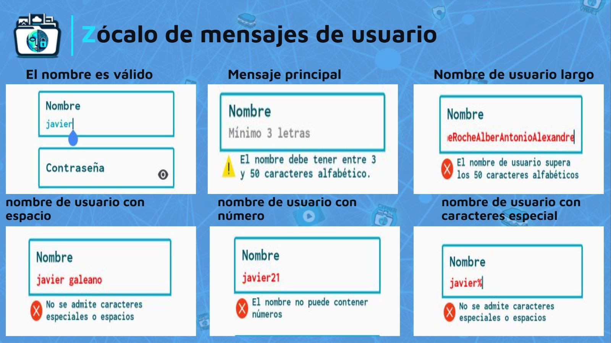
** Análogamente a la imagen anterior, en el campo de nombre también existen posibles mensajes que se presentarán a la hora de completar este campo:

*** Mensaje Principal: Este mensaje estará activo cuando el usuario quiera ingresar sus datos, se le indicara cuál es el rango de letras permitido y que debe contener caracteres alfabéticos.

*** Nombre de Usuario Largo: Si el nombre de usuario supera los 50 caracteres, se mostrará un mensaje indicando que es demasiado largo. En este caso, el usuario deberá acortarlo, además, los datos ingresado se tornaran un tono rojo indicando que algo esta fallando.

*** Nombre con Espacio: Si el usuario ingresa un nombre que contiene espacios entre caracteres, se mostrará un mensaje indicando que no se admite espacio en el campo de nombre de usuario.

*** Nombre con número: Existe la posibilidad de que el usuario ingrese caracteres numéricos. En este caso, no se permitirá esta situación, generando un mensaje debajo del campo de nombre.

*** Nombre con caracteres especiales: Similar a la situación de los caracteres con espacio, no se permite poner caracteres especiales y se genera un mensaje indicando esta situación.

*** Nombre válido: En el caso de que el usuario ingrese un nombre respetando las condiciones anteriores, desaparecerán los iconos y mensajes de precaución o mensaje de error.

==== Campo de Contraseña

** En nuestra aplicación, el campo de Contraseña es crucial para la seguridad de las cuentas de los usuario, además es un dato fundamental para poder registrase. Al completar el campo, se pueden presentar diferentes tipos de mensajes:

image::Recursos/combinacionDeMensajes/diapositiva(Contraseña).JPG[]
** A medida que el usuario ingresa la contraseña, puede surgir los mensajes de advertencia y error según los datos que se ingrese.

*** Mensaje principal: Al seleccionar el campo de contraseña, siempre existirá un mensaje predeterminado que solicita al usuario respetar ciertas condiciones para generar una contraseña. En este caso, las condiciones mínimas son 15 caracteres alfanuméricos y 1 carácter especial.

*** Contraseña con espacio: Si el usuario ingresa un espacio en el campo de contraseña, el texto ingresado se tornará en color rojo y se mostrará un mensaje de error indicando que no se permite el espacio en la contraseña.

*** Contraseña solo con caracteres especiales: Si el usuario ingresa solo caracteres especiales, se generará un mensaje indicando que la contraseña también debe contener caracteres alfanuméricos.

*** Contraseña solo con caracteres alfanuméricos: Existe la posibilidad de que el usuario ingrese solo caracteres alfanuméricos, pero no caracteres especiales. En este caso, se generará un mensaje indicando que debe ingresar un carácter especial para completar la contraseña.

*** Contraseña supera el rango de caracteres: Si el usuario ingresa una contraseña que supera el rango de 32 caracteres, se mostrará un mensaje de error indicando que ha superado el límite y el contenido del campo se tornará en rojo.

*** Contraseña válida: En el caso de que el usuario ingrese una contraseña respetando las condiciones pedidas, desaparecerá cualquier tipo de mensaje. 

==== Mensaje general:

image::Recursos/combinacionDeMensajes/diapositiva(general).JPG[]

*** En el caso hipotético de que el usuario no aprecio los mensajes de cada campo correspondiente y seleccione el botón `Registrarse`, aparecerá un mensaje de error indicando que existe un dato incorrecto en alguno de los campos. Esto impedirá que el usuario complete el registro y avance a la siguiente vista.

==== Vista Login

** Login: En la vista de inicio de sesión, se pueden apreciar diferentes tipos de cuentas que los usuarios han ingresado. Además, se han implementado mensajes de sugerencia para guiar a los usuarios durante el proceso de inicio de sesión

==== Mensaje de busqueda

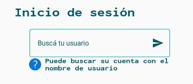

** En nuestra aplicación, hemos incluido un mensaje de sugerencia para facilitar la búsqueda de cuentas. Los usuarios pueden buscar su cuenta ingresando su nombre de usuario. Esto es especialmente útil cuando hay muchas cuentas registradas y puede resultar tedioso buscar manualmente.

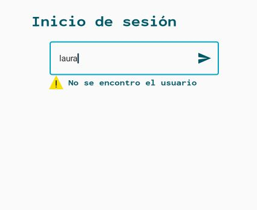

** En caso de que el usuario ingrese un nombre que no esté registrado en nuestra aplicación, se mostrará un mensaje indicando que no se encuentra en nuestra base de datos

==== Mensaje de Galeria

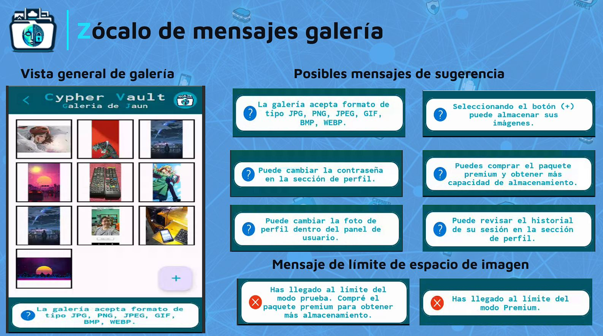

** En la sección de galería, se podrán apreciar diferentes tipos de mensajes para guiar al usuario sobre las diversas herramientas disponibles. Los tipos de mensajes incluyen:

*** Formato de imágenes: Nuestra aplicación acepta varios formatos de imagen, incluyendo JPG, PNG, JPEG, GIF, BMP y WEBP.

*** Agregar imagen: Se guiará al usuario sobre qué botón seleccionar para agregar una imagen.

*** Cambio de contraseña: Se indicará al usuario en qué parte del panel de usuario se encuentra el botón para cambiar la contraseña.

*** Recomendación de paquete premium: Se sugerirá al usuario adquirir el paquete premium para obtener más capacidad de almacenamiento. Esta recomendación estará dentro del panel de usuario.

*** Cambio de foto: El usuario podrá cambiar su foto de perfil dentro del panel de usuario haciendo clic en su imagen.

*** Historial: El usuario podrá ver la cantidad de inicios de sesión realizados.

*** Límite de capacidad en modo prueba: Se mostrará un mensaje con un icono de error indicando que se ha alcanzado el espacio disponible en modo prueba.

*** Límite de capacidad en modo premium: Similar al modo prueba, se indicará al usuario que ha alcanzado el límite de capacidad en modo premium.

** Como se puede apreciar en esta imagen, este es el panel de usuario donde podrá personalizar su cuenta.

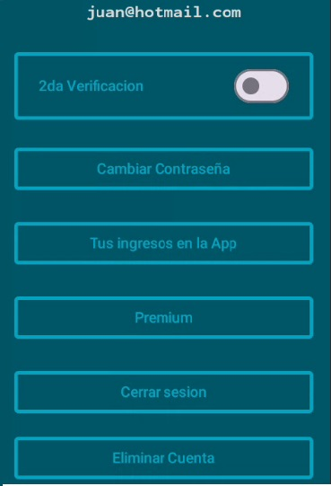

==== Vista, controlador y modelo:

** Respetando el patrón de diseño MVC, se ha separado la vista, el controlador y el modelo de los zocalos de mensajes, a contunuacion se indicara las responasabilidades de cada paquete y se explicara cual es el objetivo de cada uno.

** view > Registration > InitialScreen.kt

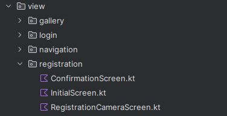

*** El paquete `view` contiene toda la parte visual donde el usuario interactúa. En este caso, es el formulario de registro. El objetivo de la `view` es visualizar los campos de registro (nombre, correo, contraseña) y los botones (registrarse, iniciar seccion). A medida que el usuario rellena los campos, la vista envía los datos al controlador.

** Controller > messages > MessageController.kt

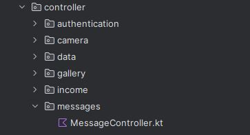

*** El paquete `Controller` se encarga de gestionar los datos ingresados por el usuario y coordinar la comunicación entre la vista y el modelo. La funcion del controlador es recibir los datos enviados desde la vista (campos de registro completados por el usuario) y enviar esos datos al modelo para su análisis y procesamiento. por ultimo, Una vez que el modelo devuelve un resultado (por ejemplo, validación exitosa o error), el controlador actualiza la vista con la respuesta correspondiente.

** Model > message > RegistrationMessage.kt

image::Recursos/MVC/model.JPG[]

*** El paquete `Model` contiene la lógica de negocio y la validación de datos. Las funciones del modelo es validar los datos, analiza los datos ingresados por el usuario (nombre, correo, contraseña) y verifica si cumplen con las condiciones requeridas. Contiene las reglas de negocio para la aplicación, por ejemplo, longitud mínima de contraseña, formato de correo válido, etc. por ultimo se obtiene una devolucion de resultados, el modelo envía una respuesta al controlador (éxitoso o erroneo) según el análisis de los datos.

=== Galeria de Imagenes

*En esta interfaz se visualizan las imagenes privadas el usuario que ya se encuentran cifradas, en la misma el usuario puede agregar sus imagenes mediante un boton, aparte tiene acceso a su perfil en el cual puede visualizar sus datos personales y actualizar su contraseña.*

==== Diseño

* Para la vista general de la galeria se utiliza el elemento Scaffold:

** En Material Design, un andamiaje es una estructura fundamental que proporciona una plataforma estandarizada para interfaces de usuario complejas. Mantiene unidas diferentes partes de la IU, como las barras de la app y los botones de acción flotantes, lo que les da a las apps un aspecto coherente.

*** *topBar:* Es la barra de la app en la parte superior de la pantalla.
*** *bottomBar:* Es la barra de la app que se muestra en la parte inferior de la pantalla.
*** *floatingActionButton:* Es un botón que se desplaza sobre la esquina inferior derecha de la pantalla que puedes usar para exponer acciones clave.
*** *Contenido Scaffold:* se agregan elementos como lo harías a otros contenedores. Pasa un valor de innerPadding a la expresión lambda content que puedes usar en los elementos componibles secundarios.

.Ejemplo de codigo generico
[source,kotlin]
----
@Composable
fun ScaffoldExample() { 
    var presses by remember { mutableIntStateOf(0) }

    Scaffold( # <1>
        topBar = { # <2>
            TopAppBar(
                colors = topAppBarColors(
                    containerColor = MaterialTheme.colorScheme.primaryContainer,
                    titleContentColor = MaterialTheme.colorScheme.primary,
                ),
                title = {
                    Text("Top app bar")
                }
            )
        },
        bottomBar = { # <3>
            BottomAppBar(
                containerColor = MaterialTheme.colorScheme.primaryContainer,
                contentColor = MaterialTheme.colorScheme.primary,
            ) {
                Text(
                    modifier = Modifier
                        .fillMaxWidth(),
                    textAlign = TextAlign.Center,
                    text = "Bottom app bar",
                )
            }
        },
        floatingActionButton = { # <4>
            FloatingActionButton(onClick = { presses++ }) {
                Icon(Icons.Default.Add, contentDescription = "Add")
            }
        }
    ) { innerPadding -> # <5>
        Column(
            modifier = Modifier
                .padding(innerPadding),
            verticalArrangement = Arrangement.spacedBy(16.dp),
        ) {
            Text(
                modifier = Modifier.padding(8.dp),
                text =
                """
                    This is an example of a scaffold. It uses the Scaffold composable's parameters to create a screen with a simple top app bar, bottom app bar, and floating action button.

                    It also contains some basic inner content, such as this text.

                    You have pressed the floating action button $presses times.
                """.trimIndent(),
            )
        }
    }
}
----
<1> Se declara el elemento contendor Scaffold
<2> Se declara la barra principal superior
<3> Se declara la barra inferior
<4> Se declada un boton flotante
<5> El contenido el cual puede tener elementos variados como textos, imagenes, etc.

==== Implementacion 

.Imagenes de la implementacion
====

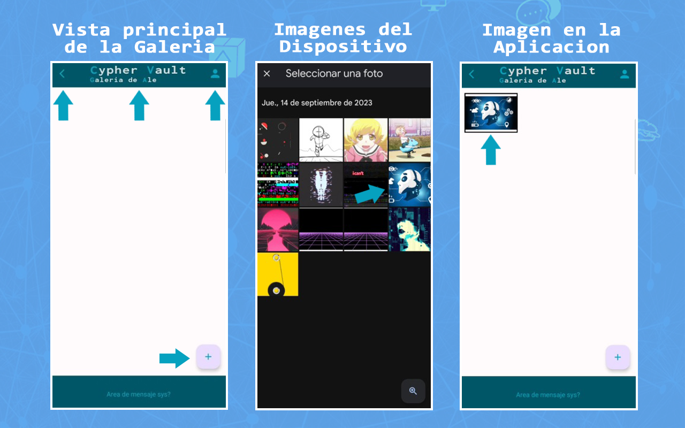

====
* *Vista principal de la galeria:* 
** boton atras
** texto con el nombre del usuario
** boton de pefil
** boton para agregar imagenes

* *Imagenes del disposivo:*
** se seleccionan las imagenes a cargar dentro de la aplicacion

* *Imagen en la aplicacion:*
** visualizacion de la imagen seleccionada dentro de la aplicacion

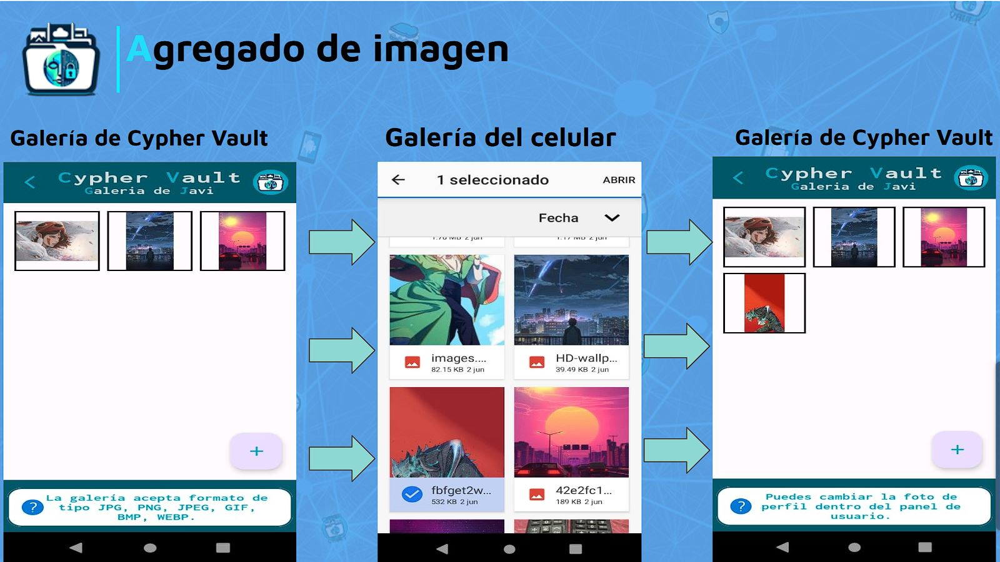

* *Eliminado de imagenes*:
** Se seleciona la imagen o las imagenes que se quiere borrar.
** En la parte inferior de la pantalla, aparecerán dos botones: "Cancelar" y "Eliminar", si se seleciona boton eliminar se borrara todas las imagenes selecionado, de lo contrario el usuario tiene la opcion de cancelar. 

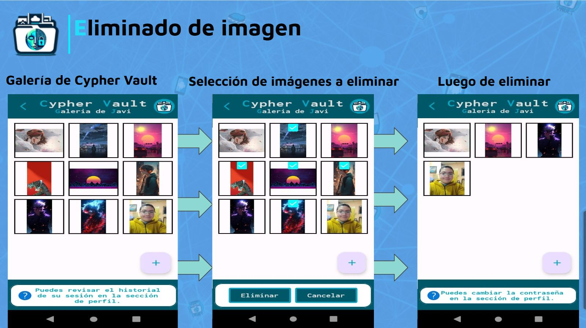

* *Dentro de la aplicacion:*

** Para esta implementacion se creo una vista llamada Gallery dentro del paquete de vistas y en paralelo se implementa el controlador GalleryController:

*** *Gallery:* dentro de la misma se encuentra toda la declaracion de los elementos visuales, con los cuales el usuario interactua.

*** *GalleryController:* tiene los accesos a la base de datos, es decir, la vista no interactua con la base de datos directamente sino que pasa por el controlador. Tanto para la carga de imagenes al inicio de la galeria como cuando se almacenan nuevas imagenes 

=== Almacenamiento

image::imagenAdoc/icondatabase.png[100,100]

*Guardar datos en una base de datos es ideal para los datos estructurados o que se repiten, como la información de contacto. En esta página, en la que se asume que estás familiarizado con las bases de datos SQL en general, encontrarás información que te ayudará a comenzar a usar bases de datos SQLite en Android. Las APIs que necesitarás para utilizar una base de datos en Android están disponibles en el paquete android.database.sqlite.*

NOTE: *Consideramos utilizar:* la libreria Room de Android Studio.

Fuente : link:https://developer.android.com/training/data-storage/room?hl=es-419#kts[android.com/room]

Fuente : link:https://developer.android.com/training/data-storage/room/defining-data?hl=es-419[android.com/room/definir_datos]

Fuente : link:https://developer.android.com/training/data-storage/room/accessing-data?hl=es-419[android.com/room/accesando_datos]

Fuente : link:https://developer.android.com/reference/kotlin/androidx/room/RoomDatabase?hl=en[android.com/room/interface]

Fuente : link:https://medium.com/@sdranju/step-by-step-how-to-setting-up-and-implementing-room-database-aeb211c56702[medium.com/tutorial_room]

WARNING: *¿Por que Room?:* Si bien estas APIs son potentes, se caracterizan por ser bastante específicas y su uso requiere de mucho tiempo y esfuerzo. No hay verificación en tiempo de compilación de las consultas de SQL sin procesar. A medida que cambia tu grafo de datos, debes actualizar manualmente las consultas de SQL afectadas. Este proceso puede llevar mucho tiempo y causar errores.
Debes usar mucho código estándar para convertir entre consultas de SQL y objetos de datos. Por estos motivos, usamos la Biblioteca de persistencias Room como una capa de abstracción para acceder a la información de las bases de datos SQLite la app.

*Componentes principales*

* Estos son los tres componentes principales de Room:

** La clase de la base de datos que contiene la base de datos y sirve como punto de acceso principal para la conexión subyacente a los datos persistentes de la app.

** Las entidades de datos que representan tablas de la base de datos de tu app.

** Los objetos de acceso a datos (DAOs) que proporcionan métodos que tu app puede usar para consultar, actualizar, insertar y borrar datos en la base de datos.

*Implementacion dentro de Android Studio*

Dentro de Android Studio es necesario la implementacion de de dependencias, especificamente dentro del  archivo `build.gradle`. A continuacion los agregados dentro la misma.

.Gradle module app
[source,kotlin]
----
plugins {
    kotlin("kapt") # <1>
}
dependencies {
  implementation("androidx.room:room-runtime:2.6.1") # <2>
  annotationProcessor("androidx.room:room-compiler:2.6.1") # <3>
	kapt("androidx.room:room-compiler:2.6.1") # <4>
}
----
<1> Libreria encargada de las anotaciones dentro de kotlin, se implementa para la correcta interpretacion de la anotacion 4.
<2> Declaracion de la dependencia Room
<3> Declaracion de las anotacionesde de Room.
<4> Agregado de las anotaciones dentro de Room.

*Paquete database*

* El mismo consta de siete archivos, como se nombro anteriormente, la base de datos en Room consta de 3 partes principales, la clase de la base de datos, las entidades de datos (tablas) y los objetos de acceso a datos (DAO) ( Interfaces en las cuales estan descriptas las querys ). 

* Los archivos son:
** AppDatabase.kt
** User.kt
** UserDao.kt
** Images.kt
** ImagesDao.kt
** ImagesRegister.kt
** ImagesRegisterDao.kt

.AppDatabase.kt
[source, kotlin]
----
@Database(entities = [User::class, Images::class, ImagesRegister::class], version = 2) # <1>
abstract class AppDatabase : RoomDatabase() {
    abstract fun userDao(): UserDao
    abstract fun imageDao(): ImageDao
    abstract fun imageRegisterDao(): ImageRegisterDao
}
----
<1> Creacion/Definicion de una base de datos con tres tablas (Usuarios, imagenes y registro de imagenes).

.User.kt
[source, kotlin]
----
@Entity
data class User(
    @PrimaryKey val uid: Long,
    @ColumnInfo(name = "first_name") val firstName: String?,
    @ColumnInfo(name = "email") val email: String?,
    @ColumnInfo(name = "entry_date") val entryDate: Long, // Fecha de ingreso
    @ColumnInfo(name = "pin") val pin: String? // PIN del usuario
) # <1>
----
<1> Definicion de la entidad User

.UserDao.kt
[source, kotlin]
----
@Dao
interface UserDao { # <1>
    @Query("SELECT * FROM user")
    fun getAll(): List<User>

    @Query("SELECT * FROM user WHERE uid IN (:userIds)")
    fun loadAllByIds(userIds: IntArray): List<User>

    @Query("SELECT * FROM user WHERE first_name LIKE :first AND " +
            "email LIKE :last LIMIT 1")
    fun findByName(first: String, last: String): User

    @Insert
    fun insert(user: User) // Método para insertar un solo usuario

    @Query("SELECT * FROM user WHERE email = :email LIMIT 1")
    fun findByEmail(email: String): User? // Método para buscar un usuario por su correo electrónico

    @Delete
    fun delete(user: User)

    @Insert
    fun insertAll(vararg users: User)

    @Query("SELECT * FROM user WHERE uid = :userId")
    fun getUserById(userId: Int): User?
}
----
<1> Interfaz de la entidad User

.Images.kt
[source, kotlin]
----
@Entity(
    tableName = "images",
    foreignKeys = [ForeignKey(
        entity = User::class,
        parentColumns = ["uid"],
        childColumns = ["user_id"],
        onDelete = ForeignKey.CASCADE
    )]
)
data class Images(
    @PrimaryKey(autoGenerate = true) val id: Long = 0,
    val imageData: ByteArray,
    val user_id: Int
) # <1>
----
<1> Definicion de la entidad Images, la misma es para el almacenamiento de las imagenes privadas ( galeria principal de la aplicacion ).

.ImageDao.kt
[source, kotlin]
----
@Dao
interface ImageDao { # <1>
    @Insert
    fun insertImage(images: Images)

    @Query("SELECT * FROM images WHERE user_id = :userId")
    fun getImagesForUser(userId: Int): List<Images>

    // Otros métodos según sea necesario
}
----
<1> Interfaz de la entidad Images

.ImagesRegister.kt
[source, kotlin]
----
@Entity(
    tableName = "images_register",
    foreignKeys = [ForeignKey(
        entity = User::class,
        parentColumns = ["uid"],
        childColumns = ["user_id"],
        onDelete = ForeignKey.CASCADE
    )]
)
data class ImagesRegister(
    @PrimaryKey(autoGenerate = true) val id: Long = 0,
    val imageData: ByteArray,
    val user_id: Int // referencia al usuario que posee la imagen
) # <1>
----
<1> Definicion de la entidad  ImagesRegister, aqui se almacenaran las imagenes de registro del usuario.

.ImagesRegisterDao.kt
[source, kotlin]
----
@Dao
interface ImageRegisterDao { # <1>
    @Insert
    fun insertImage(imagesRegister: ImagesRegister)

    @Query("SELECT * FROM images WHERE user_id = :userId")
    fun getImagesForUser(userId: Long): List<ImagesRegister>
}
----
<1> Interfaz de la entidad ImagesRegister.

*Paquete model > dbmanager*

* Se define la interfaz DataBaseManager la cual contiene las tres interfases principales UserDao, ImagesDao e ImagesRegisterDao, la misma se implementa para aislar y organizar los llamados aparte de facilitar la inicializacion de la base de datos.

.DataBaseManager.kt
[source, kotlin]
----
object DatabaseManager {
    private lateinit var database: AppDatabase

    fun initialize(context: Context) {
        database = Room.databaseBuilder(
            context.applicationContext,
            AppDatabase::class.java, "my_database"
        ).build()
    }

    // Métodos relacionados con la tabla de usuarios
    fun getAllUsers(): List<User> {
        return database.userDao().getAll()
    }

    fun getUserById(userId: Int): User? {
        return database.userDao().getUserById(userId)
    }

    fun insertUser(user: User) {
        database.userDao().insert(user)
    }

    fun deleteUser(user: User) {
        database.userDao().delete(user)
    }

    // Métodos relacionados con la tabla de imágenes
    fun insertImage(image: Images) {
        database.imageDao().insertImage(image)
    }

    fun getImagesForUser(userId: Int): List<Images> {
        return database.imageDao().getImagesForUser(userId)
    }

    // Métodos relacionados con la tabla de registros de imágenes
    fun insertImageRegister(imageRegister: ImagesRegister) {
        database.imageRegisterDao().insertImage(imageRegister)
    }

    fun getImageRegistersForImage(user_id: Long): List<ImagesRegister> {
        return database.imageRegisterDao().getImagesForUser(user_id)
    }

    // Otros métodos según sea necesario para otras operaciones con usuarios, imágenes e imágenes registros
}
----

=== Reconocimiento facial

WARNING: *Aun en desarrollo*: Se dara un breve repaso a las herramientas que se  utilizaron para el reconocimiento facial, ya que aun esta en proceso de desarrollo y para optimizar los tiempos de armado de informe se resuelve que no ira esta documentacion a detalle, pero si los conceptos utilizados hasta el momento.

.*Conceptos  preliminares*

* *Reconocimiento facial:* compara dos caras y nos dice si son o no de la misma persona.

* *Seguimiento facial:* seguimiento del rostro dentro la toma

* *Detección de landmarks:* son los puntos de interes del rostro, como ojos la barbilla orejas orejas etc.

* *Detección de contornos:* son tambien los puntos de interes del rostro, como ojos la barbilla, etc.

* *Clasificacion:* si esta con los ojos abiertos la boca abierta etc.

Fuente: link:https://developers.google.com/android/reference/com/google/mlkit/vision/face/Face[Android\Developer\MlKit\Vision\Face]

Fuente: link:https://developers.google.com/ml-kit/vision/face-detection/android?hl=es-419[Android\Developer\MlKit\Vision\FaceDetection]

Fuente: link:https://developer.android.com/media/camera/camerax?hl=es-419[Android\Developer\CameraX]

.Deteccion de Contornos
image::Recursos/face_contours.svg[700,700]

* *Librerias utilizadas en Android Studio:*

** *MLkit - FaceDetection:*
*** Con la API de detección de rostro del Kit de AA, puedes detectar rostros en una imagen, identificar rasgos faciales clave y obtener los contornos de los rostros detectados.

*** El ML Kit de Google proporciona las APIs de Vision de aprendizaje automático integradas en el dispositivo para detectar rostros, escanear códigos de barras, etiquetar imágenes y mucho más. El Analizador de ML Kit facilita la integración del kit con tu app de CameraX.

*** El Analizador de ML Kit es una implementación de la interfaz de ImageAnalysis.Analyzer. Anula la resolución objetivo predeterminada (si es necesario) para optimizar el uso del ML Kit, controla las transformaciones de coordenadas y pasa los marcos al ML Kit, que muestra los resultados agregados del análisis.

** *CameraX:*
*** CameraX es una biblioteca de Jetpack creada para que el desarrollo de una apps de cámara sea más fácil. Para las apps nuevas, te recomendamos que comiences con CameraX. Proporciona una API coherente y fácil de usar que funcione en la gran mayoría de los dispositivos Android y ofrece retrocompatibilidad con Android 5.0 (nivel de API 21).

*** CameraX destaca los casos de uso, que te permiten concentrarte en la tarea que debes completar en lugar de administrar variaciones específicas del dispositivo. Se admiten los casos de uso de la cámara más comunes:

**** *Vista previa:* Permite obtener una imagen en la pantalla.

**** *Análisis de imágenes:* Permite acceder a un búfer sin inconvenientes a fin de utilizarlo en tus algoritmos, por ejemplo, para pasar contenido a ML Kit.

**** *Captura de imágenes:* Permite guardar imágenes.

**** *Captura de video:* Permite guardar videos y audio.

* *Lineamientos para imágenes de entrada*

** Para el reconocimiento facial, se debe usar una imagen con una dimensión de al menos 480 × 360 píxeles. Para que el Kit de AA detecte rostros con precisión, las imágenes de entrada deben contener rostros representados con datos de píxeles suficientes. En general, cada rostro que quieras detectar en una imagen debe tener al menos 100 x 100 píxeles. Si deseas detectar los contornos de los rostros, ML Kit requiere una entrada de mayor resolución: cada rostro debe tener al menos 200 x 200 píxeles.

** Si detectas rostros en una aplicación en tiempo real, te recomendamos que también consideres las dimensiones generales de las imágenes de entrada. Las imágenes más pequeñas se pueden procesar más rápido. Para reducir la latencia, captura imágenes con resoluciones más bajas, pero ten en cuenta los requisitos de precisión que se mencionaron anteriormente y asegúrate de que el rostro del sujeto ocupe la mayor parte posible de la imagen.

* *Puntos de referencia*

** Un punto de referencia es un lugar de interés en un rostro. El ojo izquierdo, el ojo derecho y la base de la nariz son ejemplos de puntos de referencia.

** ML Kit detecta rostros sin buscar puntos de referencia. La detección de puntos de referencia es un paso opcional que está inhabilitado de forma predeterminada.

** En la siguiente tabla, se resumen todos los puntos de referencia que se pueden detectar dado el ángulo Euler Y de un rostro asociado:

.*Ángulo Euler Y Puntos de referencia detectables*
====
*Menos de -36 grados:* ojo izquierdo, boca izquierda, oreja izquierda, base de la nariz, mejilla izquierda.

*De -36 a -12 grados:* boca izquierda, base de la nariz, parte inferior de la boca, ojo derecho, ojo izquierdo, mejilla izquierda, punta de la oreja izquierda

*De -12 a 12 grados:* ojo derecho, ojo izquierdo, base de la nariz, mejilla izquierda, mejilla derecha, boca izquierda, boca derecha, parte inferior de la boca

*De 12 a 36 grados:* boca derecha, base de la nariz, parte inferior de la boca, ojo izquierdo, ojo derecho, mejilla derecha, punta de la oreja derecha

*Más de 36 grados:*	ojo derecho, boca derecha, oreja derecha, base de la nariz, mejilla derecha

Cada punto de referencia detectado incluye su posición asociada en la imagen.
====

* *Contornos*

** Un contorno es un conjunto de puntos que representan la forma de una característica facial. Se basa en puntajes que arroja la libreria por ejemplo :

.Óvalo de rostro 36 puntos:
[cols=2*,options=header]
|===
|Parte del rostro | Cantidad
|Labio superior (parte superior) |	11 puntos
|Ceja izquierda (parte superior) |	5 puntos	
|Labio superior (parte inferior) |	9 puntos
|Ceja izquierda (parte inferior) |	5 puntos	
|Labio inferior (parte superior) |	9 puntos
|Ceja derecha (parte superior) |	5 puntos	
|Labio inferior (parte inferior) |	9 puntos
|Ceja derecha (parte inferior) |	5 puntos	
|Puente nasal |	2 puntos
|Ojo izquierdo |	16 puntos	
|Parte inferior de la nariz	| 3 puntos
|Ojo derecho |	16 puntos
|Mejilla izquierda (centro) |	1 punto
|Mejilla derecha (centro) |	1 punto
|===

** Cuando obtienes todos los contornos de un rostro a la vez, se obtiene un array de 133 puntos, que se asignan a los contornos de los rasgos como se muestra a continuación:

.Índices de contornos de características
[cols=2*,options=header]
|===
|Cantidad de puntos | Parte del rostro
|0-35|	Óvalo de rostro
|36-40|	Ceja izquierda (parte superior)
|41-45|	Ceja izquierda (parte inferior)
|46-50|	Ceja derecha (parte superior)
|51-55|	Ceja derecha (parte inferior)
|56-71|	Ojo izquierdo
|72-87|	Ojo derecho
|88-96|	Labio superior (parte inferior)
|97-105|	Labio inferior (parte superior)
|106-116|	Labio superior (parte superior)
|117-125|	Labio inferior (parte inferior)
|126-127|	Puente nasal
|128-130|	Parte inferior de la nariz (ten en cuenta que el punto central está en el índice 128)
|131|	Mejilla izquierda (centro)
|132|	Mejilla derecha (centro)
|===

* *Distancia Euclidiana*

** La distancia euclidiana es una medida de distancia entre dos puntos en un espacio euclidiano. En el contexto del reconocimiento facial, los landmarks son puntos específicos en la cara, como la punta de la nariz, las esquinas de los ojos, etc. Para calcular la distancia euclidiana entre dos landmarks (puntos), primero necesitas tener las coordenadas de cada punto en forma de lista o tupla.

** Supongamos que tienes dos landmarks representados por tuplas (x1, y1) y (x2, y2). Se utiliza a distancia euclidiana entre dos puntos los cuales pertenecen a un Landmark especifico del rostro, estos estan contenidos en las listas de informacion de cada una de las capturas, luego hay un margen de error o umbral de error de distancia entre los puntos llamado threshold. Esta distancia calculada si esta dentro del umbral o margen impuesto por nosotros puede utilizarse para reconocer rostros, ya que los landmarks son puntos especificos de cada rostro lo cual arman la singularidad de la persona. A este tipo de reconocimiento se podria llamarlo de similaridad y tiene una formula especifica:

====
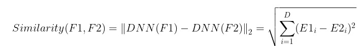
====

* Para lo cual dentro de nuestra aplicacion tenemos una herramienta que  nos permite calcular la distancia euclidiana.

.Dentro de nuestra aplicacion
[source, kotlin]
----
val thresholdLandmarks = 20.0

fun calcularDistanciaEuclidiana(lista1: List<PointF>, lista2: List<PointF>): Double { # <1>
    if (lista1.size != lista2.size) {
        throw IllegalArgumentException("Las listas deben tener el mismo tamaño")
    }

    return lista1.zip(lista2) { punto1, punto2 ->
        val dx = punto1.x - punto2.x
        val dy = punto1.y - punto2.y
        sqrt(dx * dx + dy * dy.toDouble())
    }.sum()
}

fun areFacesSimilar( # <2>
    face1Points: List<PointF>,
    face2Points: List<PointF>,
    threshold: Double
): Boolean {
    val distance = calcularDistanciaEuclidiana(face1Points, face2Points)
    return distance <= threshold
}
----
<1> Funcion para calcular la distancia Euclidea entre dos puntos en un plano, en nuestro caso la distancia que hay entre la posicion de una parte del rostro de una captura y otra ( Imagen del registro y la Imagen del login )
<2> Funcion en donde entran los dos puntos, llama a la funcion de distancia y se lo compara con el threshold.

.*Explicacion de la logica del sistema de reconocimiento facial dentro del proyecto*

* Luego de llenar el formulario de registro se posiciona al usuario dentro de la pantalla de captura de imagenes.

* La captura se realiza y se almacenan la informacion de la imagen en la base datos junto a los Landmarks y los Contornos con el ID del usuario. Luego pasa a la pantalla de confirmacion de registro, donde se encuentra un boton para inicio de sesion, al presionalo se redirige al usuario a la pantalla lo inicio de sesion.

* En la pantalla de inicio de sesion nos encontramos con una lista donde aparece el nombre y el mail del usuario. El usuario presiona el boton y se lo redirige automaticamente al area de captura de imagenes y se toma la foto.

* Al momento de tomarse la foto, se compara la informacion de Landmarks de la foto del registro y la foto del logueo punto a punto, mediante la funcion de distancia euclidiana.

* Si hay mas de 8 puntos de los 10 que son en total que verifican dentro del threshold Landmarks, entonces retorna true. Y pasa a la pantalla de galeria, en caso de no verificar se reintenta la toma fotografica, hasta que verifique.

*Notas de implementacion al 5 de mayo*

NOTE: *Mejora herramientas basicas:* como esta en fase de desarrollo las comprobaciones son basicas pero se tienen pensadas varias herramientas para la mejora de la comprobacion de persona, ya que no estamos utilizando modelos entrenados de Inteligencia Artificial. El unico que se utiliza es la API MLKIT, pero la misma es para deteccion de rostros no para reconocimiento (link:https://developers.google.com/ml-kit/vision/face-detection?hl=es-419[documentacion, solo ver el inicio, donde aparece esto nombrado anteriormente]) pero dice que la api sive tambien para "identificar rasgos faciales clave", entonces para el reconocimiento se implementaran herramientas ( codigo ) que utilicen Landmarks y Contornos del rostro, es decir, sera de diseño propio.

NOTE: *Mejora en la captura:* mejora en la captura fotografica, realizando el recorte del rostro y recien en ese momento la toma de datos ( landmarks y contornos ), luego enderezamientos utilizando puntos del rostro, para que los rostros queden alineados al eje Y.

NOTE: *Mejoras visuales:* verificacion del tamaño del rostro en pantalla, ya que si los rostros son de distintas dimensiones, el codigo no funciona, avisos visuales al usuario los cuales le iran indicando que tiene que tiene que hacer en el area de captura de fotos ( Acercarse a la camara, alejarse, inclinacion de rostro en ese Y y Z, subir o bajar el rostro dentro del area de captura ), con verificaciones visuales para asegurar el margen de error en este area tan critica.

=== Reconocimiento facial implementación al día 20/05

* *Detección de Rostros en Tiempo Real y Captura de Fotos*
** Esta implementación también utiliza ML Kit para la detección de rostros. El registro funciona en tiempo real y cuando se detecta un rostro, se comienza un temporizador de 3 segundos. Si el rostro se mantiene en el cuadro durante estos 3 segundos, la aplicación toma una foto y la guarda en la base de datos para luego poder utilizarla en el reconocimiento.

** Para el inicio de sesión, el proceso de detección de rostros en tiempo real y captura de fotos se repite. Cuando el usuario inicia sesión, la aplicación detecta el rostro del usuario y toma una foto después de 3 segundos. Esta foto se utiliza para compararla con la del registro guardada en nuestra base de datos.

** La aplicación utiliza un modelo de TensorFlow Lite cargado localmente para extraer características del rostro. Luego, compara estas características con las características del rostro guardado en la base de datos para verificar la identidad del usuario. Para compararlas se utiliza lo mencionado anteriormente. La distancia euclidiana

* *Librerías utilizadas:*
** *TensorFlow Lite:* Es una biblioteca que permite ejecutar modelos de machine learning en dispositivos móviles.

* *Funciones utilizadas:*

[source, kotlin]
----
fun loadModelFile(assetManager: AssetManager, modelPath: String): MappedByteBuffer {
    val fileDescriptor: AssetFileDescriptor = assetManager.openFd(modelPath)
    val inputStream = FileInputStream(fileDescriptor.fileDescriptor)
    val fileChannel: FileChannel = inputStream.channel
    val startOffset: Long = fileDescriptor.startOffset
    val declaredLength: Long = fileDescriptor.declaredLength
    return fileChannel.map(FileChannel.MapMode.READ_ONLY, startOffset, declaredLength)
}
----

*loadModelFile* esta función carga el modelo utilizado llamado MobileFaceNet en la aplicación.

[source, kotlin]
----
fun extractFaceFeatures(model: Interpreter, faceImage: Bitmap): FloatArray {
    val faceFeatures = Array(1) { FloatArray(192) } // El modelo produce 192 características
    val faceImageBuffer = convertBitmapToBuffer(faceImage) 
    model.run(faceImageBuffer, faceFeatures)
    return faceFeatures[0] 
}
----

*extractFaceFeatures* : Esta función utiliza el modelo para extraer características del rostro en la imagen proporcionada. Las características son un conjunto de 192 valores flotantes que representan diferentes aspectos del rostro.

[source, kotlin]
----
fun compareFaceFeatures(features1: FloatArray, features2: FloatArray): Float {
    var sum = 0.0f
    for (i in features1.indices) {
        sum += (features1[i] - features2[i]).pow(2)
    }
    val result = sqrt(sum)
    return result
}
----

Por último tenemos la función *compareFaceFeatures* la cuál se encargara de calcular la distancia euclidiana entre los dos conjuntos de características extraídas anteriormente. Como ya fue explicado se tiene un umbral y si entra dentro de ese rango decimos que los dos rostros pertenecen a la misma persona.

=== Reconocimiento facial ( con internet )

* *Detección de Rostros en Tiempo Real y Captura de Fotos*

** Esta implementación también utiliza lo mismo que la anterior para la detección facial.

** En el servidor, tenemos dos versiones de una API para el reconocimiento facial. Ambas versiones de la API reciben la foto del usuario y la comparan con la foto guardada en la base de datos para verificar la identidad del usuario.

NOTE: *Las dos API utilizan Flask como framework para construir la app web.*

==== API Versión 1

Esta API proporciona un servicio para comparar dos caras en imágenes diferentes. Utiliza la biblioteca face_recognition para la detección y comparación de caras.

* *Librerias utilizadas:*
** *Numpy:*
*** Es una biblioteca que da soporte para crear vectores y matrices grandes multidimensionales, junto con una gran colección de funciones matemáticas de alto nivel ya que permite trabajar con datos numéricos de manera eficiente. 
** *cv2:*
*** Es una biblioteca de OpenCV para Python que proporciona funciones y algoritmos para el procesamiento de imágenes y vídeo.
** *face_recognition:*
*** Es una biblioteca simple de reconocimiento facial que incluye detección de rostros, reconocimiento de rostros y manipulación de rostros.

*Endpoint*
[source, python]
----
@app.route('/compare_faces', methods=['POST'])
def compare_faces():
    image1 = np.frombuffer(request.files['image1'].read(), np.uint8)
    image2 = np.frombuffer(request.files['image2'].read(), np.uint8)
----

*POST /compare_faces*

Toma dos imágenes en formato binario como parámetro

[source, python]
----
face_location1 = face_recognition.face_locations(image1)[0]
face_location2 = face_recognition.face_locations(image2)[0]
face_image1_encodings = face_recognition.face_encodings(image1, known_face_locations=[face_loc1])[0]
face_image2_encodings = face_recognition.face_encodings(image2, known_face_locations=[face_loc2])[0]
----

Se utiliza *face_locations* de face_recognition para detectar el rostro de la imágen y luego *face_encodings* para decodificar el rostro en un vector de 128 dimensiones.
Por último se utiliza la función *compare_faces* también de face_recognition y se guarda el resultado en una variable. Esta variable es la que se devuelve en un objeto JSON a la aplicación con un true si las dos caras son de la misma persona o false en caso contrario.

[source, python]
----
result = face_recognition.compare_faces([face_image1_encodings], face_image2_encodings, 0.5)
return jsonify({"result": bool(result[0])})
----

==== API Versión 2

Esta API proporciona un servicio para comparar dos caras en imágenes diferentes. Utiliza la biblioteca facenet_pytorch y cv2 para la detección y comparación de caras.

* *Librerias utilizadas:*
** *Numpy*: 
*** Es una biblioteca que da soporte para crear vectores y matrices grandes multidimensionales, junto con una gran colección de funciones matemáticas de alto nivel ya que permite trabajar con datos numéricos de manera eficiente. 
** *cv2:*
*** Es una biblioteca de OpenCV para Python que proporciona funciones y algoritmos para el procesamiento de imágenes y vídeo. 
** *facenet_pytorch:* 
*** Es una biblioteca que proporciona una implementación de FaceNet, un sistema de reconocimiento facial que utiliza una red neuronal para extraer características útiles de las imágenes de los rostros.

*ENDPOINT* 

[source, python]
----
@app.route('/compare_faces', methods=['POST'])
def compare_faces():
    image1 = np.frombuffer(request.files['image1'].read(), np.uint8)
    image2 = np.frombuffer(request.files['image2'].read(), np.uint8)
----

*POST /compare_faces*

Toma dos imágenes en formato binario como parámetro

[source, python]
----
embedding1 = get_embedding(resizedImage1)
embedding2 = get_embedding(resizedImage2)
----
Se llama a la función get_embedding para guardar la codificación del rostro en una variable.

[source, python]
----
def get_embedding(img):
        # Detectar rostros
    faces = face_cascade.detectMultiScale(img, 1.1, 4)
    # Para cada rostro detectado, extraer las características con FaceNet
    for (x, y, w, h) in faces:
        face = img[y:y+h, x:x+w]
        face = cv2.resize(face, (160, 160))
        face = Image.fromarray(face)
        face = np.array(face)  # Convertir la imagen a un array de NumPy
        face = torch.unsqueeze(torch.tensor(face), 0)
        embedding = model(face.permute(0, 3, 1, 2).float())
            
        return embedding
----

Se utiliza esta función para detectar los rostros y obtener las características.

<1> *Se detecta el rostro*:
*  Se utiliza un clasificador de cascada Haar pre-entrenado (en este caso, ‘haarcascade_frontalface_default.xml’ de OpenCV) para detectar rostros en la imagen.
<2> *Extraer las características del rostro.:*
* Una vez se detecta el rostro se extrae de la imagen. Luego, se redimensiona la imagen del rostro a un tamaño fijo (en este caso, 160x160 píxeles).
<3> *Codificación del rostro:*
* La imagen del rostro se pasa a través del modelo FaceNet pre-entrenado para obtener una representación numérica, o “incrustación”, del rostro. Esta incrustación es un vector de 512 dimensiones12 que captura las características únicas del rostro.
<4> *Se devuelve para compararlos*

Por último se comparan las distancias y se devuelve la respuesta.
[source, python]
---- 
    distance = torch.dist(embedding1, embedding2)
    print(distance)
    # Si la distancia es menor a un cierto umbral, entonces los rostros son el mismo
    if distance < 0.36:
        return jsonify({"result": True})
    else:
        return jsonify({"result": False})\
----

<1> *Cálculo de la distancia:*
* La línea distance = torch.dist(embedding1, embedding2) está calculando la distancia entre las dos "incrustaciones" (mencionadas anteriormente) de rostros. La función torch.dist calcula la distancia euclidiana entre estos dos vectores, que es una medida de cuán diferentes son las dos caras.

<2> *Comparación de la distancia con un umbral:*
* La distancia calculada se compara con un umbral predefinido de 0.36. Este umbral es un valor que se ha elegido para determinar si dos caras son la misma persona. Si la distancia es menor a 0.36, entonces se considera que las caras son de la misma persona.

<3> *Devolución del resultado a la aplicación*

NOTE: Se decidió implementar el reconocimiento facial sin internet y con el modelo de TensorFlow Lite.
